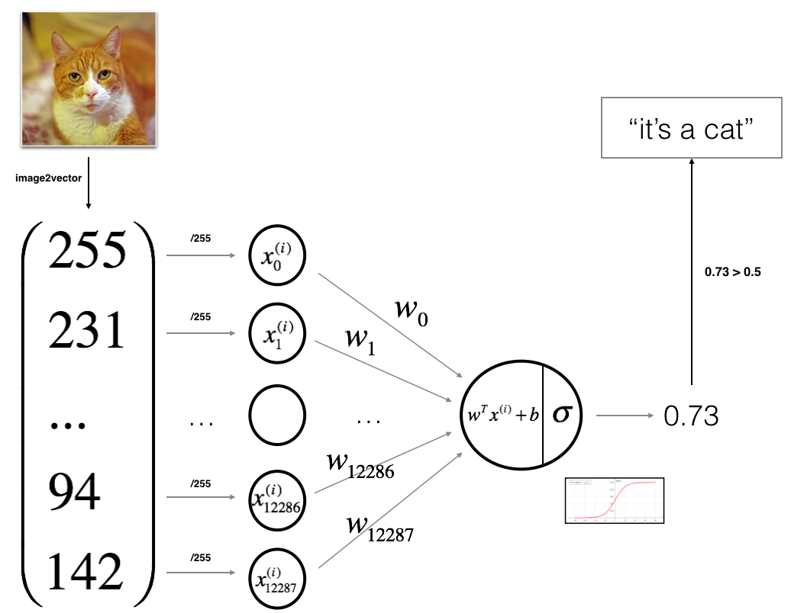
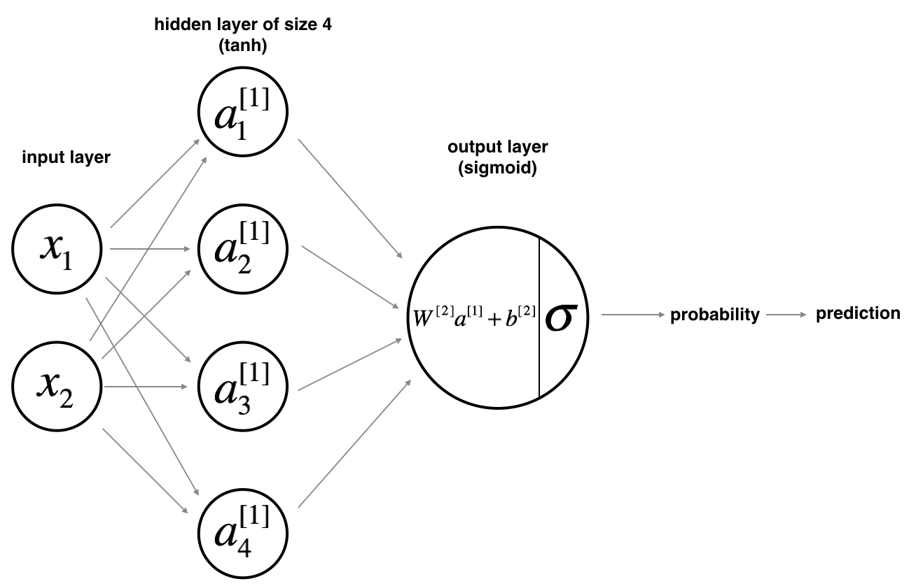
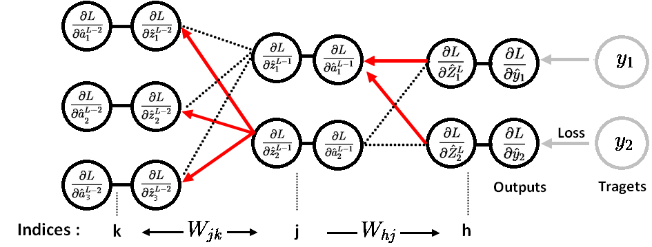

# Specialisation 1: Neural networks for Deep Learning

## Logistic Regression

Parameters & inputs :
* X : inputs x batch
* W : inputs x outputs
* b: 1 x outputs

Logistic regression: Given X, we want $y_{predicted} = P(y=1 | x)$

To have the output in the range of [0,1], to be interpreted as probability, we use a non linear activation function : sigmoid, to squash the results:

$$y_{predicted} = sigmoid(W^T  X + b)\ = \frac{1}{1 + e^{-(W^T x + b)}} $$
W : [Inputs x Outputs] and X : [Inputs x Batch]

Cost Function : Given Inputs and their Targets, our goal is to have the predictions to be equal to the Targets.
We define a loss function to be a convex function to be able to find its minimum, if we use a MSE loss function, the 
loss function becomes non convexe.

#### Side not, why we use Max Likelihood for classification ?
When we perform binary classification model (with classes 1 and -1),  we use the input X to arrive at a continuous prediction $y_{predicted}$ where for $y_{predicted}$>=0, we classify that observation as class 1, otherwise to class -1.

How do we judge the performance, ideally, we want to maximize the accuracy, by giving a zero loss if sign of $y_{predicted}$ agree with the sign of the true class, i.e. $y. y_{predicted}$>=0 . Otherwise, if we make the wrong prediction, the loss is 1.

Given that:
- If y = 1, $P(y|x) = y_{predicted}$.
- If y = 0, $P(y|x) = 1 - y_{predicted}$.

The loss function, that is the closer to such objective, while being a convex function is 

$$l(y, y_{predicted}) = - ( y\ log(y_{predicted}) + (1 - y)\ log(1 - y_{predicted}))$$

If $y = 0$, so we want $y_{predicted}$ to be small, and this is dones by minimising the loss $l = - log(y_{predicted})$

Cost function measure the performances over all the training set, just the average loss over all example.
$$ J = \frac{1}{m} \sum_{i=1}^m \mathcal{L}(y^i, y_{predicted}^i)$$

So we can write the probability as : $P(y|x) = y_{predicted}^y \times (1- y_{predicted})^{(1 - y)}$

The objective is to maximise $P(y|x)$, given that for multiple example (iid), we'd like to maximise the product of their probabilities, so it is easier to use the lod, which is a monotonic function, and maximise their summation, or minimise - loss.

#### Derivatives

$$\frac{dl}{dw} = \frac{dl}{dy_{predicted}} \frac{dy_{predicted}}{dz} \frac{dz}{dw}$$
$$z = W^T X + b,\ \text{Thus}\ \frac{dz}{dw} = X$$
$$y_{predicted} = sigmoid(z),\ \text{Thus}\  \frac{dy_{predicted}}{dz} = y_{predicted}(1 - y_{predicted})$$
$$\frac{dl}{dy_{predicted}} = \frac{(y_{predicted} - y)}{y_{predicted}(1 - y_{predicted})}$$
$$\text{So} : \frac{dl}{dw} = X (y_{predicted} - y)$$

#### Logitic regression as NN

Logistic regression can also be viewed as a one layer neural net:
For one example $x^{(i)}$:
$$z^{(i)} = w^T x^{(i)} + b$$
$$y_{predicted}^{(i)} = a^{(i)} = sigmoid(z^{(i)})$$
$$ \mathcal{L}(a^{(i)}, y^{(i)}) =  - y^{(i)}  \log(a^{(i)}) - (1-y^{(i)} )  \log(1-a^{(i)})$$

Forward Propagation:
- Get an training set X (m examples)
- Compute $A = \sigma(w^T X + b) = (a^{(1)}, a^{(2)}, ..., a^{(m-1)}, a^{(m)})$
- Calculate the cost function: $J = -\frac{1}{m}\sum_{i=1}^{m}y^{(i)}\log(a^{(i)})+(1-y^{(i)})\log(1-a^{(i)})$

Backward Propagation:
- Compute garadients with the cost respect to the weights $\frac{\partial J}{\partial w} = \frac{1}{m}X(A-Y)^T$
- And to the bias $\frac{\partial J}{\partial b} = \frac{1}{m} \sum_{i=1}^m (a^{(i)}-y^{(i)})$
- For a parameter $\theta$ (weights & bias), we update by $\theta = \theta - \alpha \text{ } d\theta$, where $\alpha$ is the learning rate, 

In order for Gradient Descent to work we must choose the learning rate wisely. The learning rate α determines how rapidly we update the parameters. If the learning rate is too large we may "overshoot" the optimal value. Similarly, if it is too small we will need too many iterations to converge to the best values. That's why it is crucial to use a well-tuned learning rate.

An example of logistic regression applied to cats:

## Notes
#### Broadcasting & Numpy

For a matrix of size (m, n), if we apply an operation using an (1, n) matrix, the latter will be broadcasted into (m, n), i.e., the row will be copied m times, same for an (m, 1) matrix, the column will be braodcasted n times into (m, n).

In we create a vector of random gussian values : `a = np.random.rand(5)`, this in case, a is rank one matrix with a shape of (5,), if we do a.T we'll get the same output, and a @ a.T gives us a scalar instead of 5 x 5 matrix, it is easier to specify the dimensions of the desired matrix, such as `a = np.random.rand(5, 1)`

#### Activation function
The tanh activation usually works better than sigmoid activation function for hidden units because the mean of its output is closer to zero, and so it centers the data better for the next layer. But for binary classifiers, it is better to use singmoid functions as the outputs layer in case the output is in the range of [0,1].

#### Zero initiallisation
Each neuron in the first hidden layer will perform the same computation. So even after multiple iterations of gradient descent each neuron in the layer will be computing the same thing as other neurons. Logistic regression's weights w should be initialized randomly rather than to all zeros, because if you initialize to all zeros, then logistic regression will fail to learn a useful decision boundary because it will fail to "break symmetry".

## Shallow neural nets
Logistic regression is very limited, we go directly from the inputs to the prediction, one possible way to improve the performance is to add a hidden layer to learn higher level abstraction of the inputs:

For one example $x^{(i)}$:
$$z^{[1] (i)} =  W^{[1]} x^{(i)} + b^{[1]}$$
$$a^{[1] (i)} = \tanh(z^{[1] (i)})$$
$$z^{[2] (i)} = W^{[2]} a^{[1] (i)} + b^{[2]}$$
$$y^{(i)}_{prediction} = a^{[2] (i)} = \sigma(z^{ [2] (i)})$$
$$y^{(i)}_{prediction} = \begin{cases} 1 & \text{if } a^{[2](i)} > 0.5 \\ 0 & \text{otherwise } \end{cases}$$

Given the predictions on all the examples, we can also compute the cost $J$ as follows: 
$$J = - \frac{1}{m} \sum\limits_{i = 0}^{m} \large\left(\small y^{(i)}\log\left(a^{[2] (i)}\right) + (1-y^{(i)})\log\left(1- a^{[2] (i)}\right)  \large  \right) \small$$

The general methodology to build a Neural Network is to:
1. Define the neural network structure ( # of input units,  # of hidden units, etc). 
2. Initialize the model's parameters
3. Loop:
	- Implement forward propagation
	- Compute loss
	- Implement backward propagation to get the gradients
	- Update parameters (gradient descent)

## Deep neural nets
Now instead of having only one hidden layer, we can add as many as we want to give the netword the ability to computes more complex functions, and the same computations are applied:

**Notation**:
- Superscript $[l]$ denotes a quantity associated with the $l^{th}$ layer. 
    - Example: $a^{[L]}$ is the $L^{th}$ layer activation. $W^{[L]}$ and $b^{[L]}$ are the $L^{th}$ layer parameters.
- Superscript $(i)$ denotes a quantity associated with the $i^{th}$ example. 
    - Example: $x^{(i)}$ is the $i^{th}$ training example.
- Lowerscript $i$ denotes the $i^{th}$ entry of a vector.
    - Example: $a^{[l]}_i$ denotes the $i^{th}$ entry of the $l^{th}$ layer's activations)

### Forward and backprop

**Forward propagation:**

In forward propagation, we apply the same operation $Z^{[l]} = W^{[l]}A^{[l-1]} +b^{[l]}$ to go from one layer (l - 1) to the next (l) using the weight matrix $W^{[l]}$ and bias $b^{[l]}$.
- In general the operations applied are: (LINEAR -> ACTIVATION) x (L-1) -> LINEAR -> SIGMOID
	- LINEAR : $Z^{[l]} = W^{[l]}A^{[l-1]} +b^{[l]}$
	- ACTIVATION : either $A^{[l-1]} = Relu(Z^{[l]})$ or $A^{[l-1]} = \tanh(Z^{[l]})$
	- SIGMOID : $a^{[L]} = y_{predicted} = \sigma(Z^{[L]})$
- After that we compute the cross-entropy cost $J$, using the following formula: $-\frac{1}{m} \sum\limits_{i = 1}^{m} (y^{(i)}\log\left(a^{[L] (i)}\right) + (1-y^{(i)})\log\left(1- a^{[L](i)}\right))$

**Backpropagation propagation:**
In backpropagation, the goal is to calculate the derivatives of the cost function in respect to the parameters of the model (the weights and biases), to be able to update them using gradient descent.

The backpropagation is very similar to the forward propagation, the difference is that this time instead of calculating the activations for the first layer to the last, we'll backpropagate the error from the last layer to the first, each time step, by calculating the derivatives of the cost with respect to the activations $\frac{\partial{J}}{\partial{a^l}}$. and reuse $\frac{\partial{J}}{\partial{a^l}}$ of the last layer to calculate the derivatives of the cast with respect to the weights and biases.

**Derivation of the backprop equations:**

For layer L:

$$ \frac{\partial{L}}{\partial{w_{hj}^L}} = \frac{\partial{L}}{\partial{a_{h}^L}} \frac{\partial{a_{h}^L}}{\partial{z_{h}^L}} \frac{\partial{z_{h}^L}}{\partial{w_{hj}^L}} $$

$$\frac{\partial{L}}{\partial{a_{h}^L}} = (\hat{y_h} - y)$$

$$ \frac{\partial{a_{h}^L}}{\partial{z_{h}^L}} = \sigma(a_{h}^L) (1- \sigma(a_{h}^L))$$

$$ \frac{\partial{z_{h}^L}}{\partial{w_{hj}^L}} = a_j $$

So first we calculate the error / loss, and then its derivative with respect to the ouputs (here when we use L2 loss), pass thought the non linearity, and then to get the derivatives with respect to the parameters, we multiply by the inputs of the previous layer $a_j$

The next step is to back propagate the derivatives of the cost with respect to the activation of layer L to layer L-1 and get the derivatives with respect to the activations of layer L-1, and then we get derivatives with respect to the parameters the same way, by multiplying the local derivatives to the inputs of the previous layer L-2:

For layer L - 1:
$$ \frac{\partial{L}}{\partial{w_{jk}^{L-1}}} = \frac{\partial{L}}{\partial{a_{k}^{L-1}}} \frac{a_{k}^{L-1}}{\partial{z_{k}^{L-1}}} \frac{\partial{z_{k}^{L-1}}}{\partial{w_{jk}^{L-1}}} $$

We get the values with the same equations, the only difference this time, is to get $\frac{\partial{L}}{\partial{a_{k}^{L-1}}}$ we need to sum over the upcoming gradients from the last layer:

$$ \frac{\partial{L}}{\partial{a_{k}^{L-1}}} = \sum_h \frac{\partial{z_{h}^{L}}}{\partial{a_{k}^{L-1}}} \frac{\partial{a_{h}^{L}}}{\partial{z_{h}^{L}}} \frac{\partial{L}}{\partial{a_{h}^{L}}} = \sum_h W_{hj} \frac{\partial{a_{h}^{L}}}{\partial{z_{h}^{L}}} \frac{\partial{L}}{\partial{a_{h}^{L}}} $$

This is done until we get the input layer, where we end up with the derivatives of the cost with respect the inputs (we don't use them generally, but can be used for some application like style transfer when we update the image and not the parameters of the model).