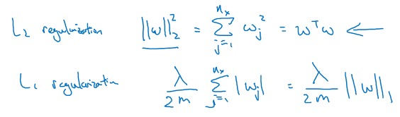
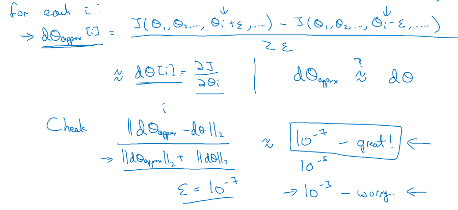
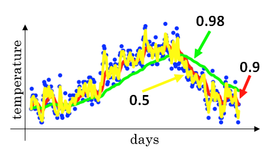
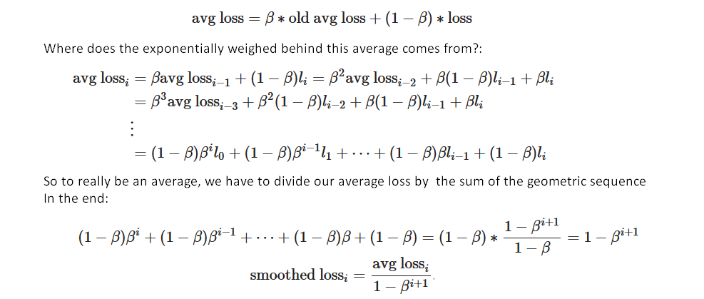
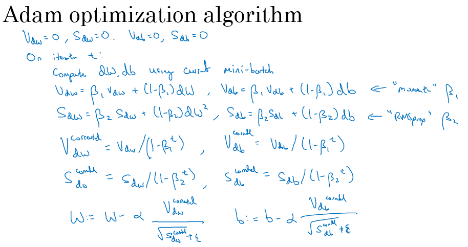
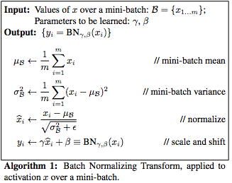

# Specialisation 2: Improving Deep Neural Networks

## WEEK 1

### Normalizing and initialisation

We can normelize our example by subtracting the mean and scaling by the variance, by we must apply the same mean and variance to the test set. This helps the gradient descent to find the optima much quickly with less steps.

Initialisation, we'd like to have the activations Z with zero mean and unit variance, for that, it is better to initialize the weights with from a guassian random variables and multiply by $\frac{1}{N(l-1)}$ to ensure unit variance, ($\frac{2}{N(l-1)}$ for Relu works better), for tanh we use $sqrt(\frac{1}{N(l-1)})$, other version is $sqrt(\frac{1}{N(l-1) + N(l)})$.

**Zero initialization:**

In general, initializing all the weights to zero results in the network failing to break symmetry. This means that every neuron in each layer will learn the same thing, and you might as well be training a neural network with n[l]=1 for every layer, and the network is no more powerful than a linear classifier such as logistic regression. It is however okay to initialize the biases $b^{[l]}$ to zeros. Symmetry is still broken so long as $W^{[l]}$ is initialized randomly. 

**Random initialization:**

- The cost starts very high. This is because with large random-valued weights, the last activation (sigmoid) outputs results that are very close to 0 or 1 for some examples, and when it gets that example wrong it incurs a very high loss for that example. Indeed, when $\log(a^{[3]}) = \log(0)$, the loss goes to infinity.
- Poor initialization can lead to vanishing/exploding gradients, which also slows down the optimization algorithm. 
- If we train the network longer we will see better results, but initializing with overly large random numbers slows down the optimization.

In summary:
- Initializing weights to very large random values does not work well. 
- Hopefully intializing with small random values does better. The important question is: how small should be these random values be?

In summary:
- Initializing weights to very large random values does not work well. 
- Hopefully intializing with small random values does better and it is used to get the variance equal to one. The important question is: how small should be these random values be? We have different possibilities:
    - Xavier initialization: uses a scaling factor for the weights $W^{[l]}$ of `sqrt(1./layers_dims[l-1])`.
    - He initialization uses `sqrt(2./layers_dims[l-1])`. Works well for networks with ReLU activations.

### Variance / Bias

High variance = overfitting, High bias = underfitting,

If the error in the train set and dev set are both high, then we have both high bias and high variance. This case is very possible in high dimensions, where we have high bias is some regions and high variance in some regions.

To get rid of high bias, we can train a bigger network until the bias is reduced, if we have high variance, we can try getting more data, regularization, or new architectures

### Regularization

##### L1 & L2

Using L1 regularization will make w sparse. And what that means is that the matrix w will have a lot of zeros in it. This can help with compressing the model, because a good set of parameters are zero, and we need less memory to store the model. But in practice this does not help that much,

<p align="center">  </p>

For Neural network, L2 regulariztion is the Frobenius Norm, also called weight decay (weight decay = A regularization technique (such as L2 regularization) that results in gradient descent shrinking the weights on every iteration).

Regularization helps us having a simple network, and for tanh per example, staying in the linear region (a simpler network not prone to overfitting, like a linear regression).

L2-regularization relies on the assumption that a model with small weights is simpler than a model with large weights. Thus, by penalizing the square values of the weights in the cost function we drive all the weights to smaller values. It becomes too costly for the cost to have large weights! This leads to a smoother model in which the output changes more slowly as the input changes.

When adding regularization, we'll have cost function and back prop by adding the regularization term's gradient ($\frac{d}{dW} ( \frac{1}{2}\frac{\lambda}{m}  W^2) = \frac{\lambda}{m} W$).

##### Dropout

It randomly shuts down some neurons in each iteration from one layer to the next. At each iteration, we shut down (set to zero) each neuron of the privious layer with probability (1−keep_prob) or keep it with probability keep_prob. When we shut some neurons down, we actually modify the model. The idea behind drop-out is that at each iteration, we train a different model that uses only a subset of the neurons. With dropout, the neurons thus become less sensitive to the activation of one other specific neuron, because that other neuron might be shut down at any time.

Implementing Dropout, called inverted dropout, create a matix Dl for a given layer l, where each element coresponds to an activation in layer l of the matrix of activations Al, each element is random values, if this random values is less than keep_prob, then if will be assgined 1, we multiply the two and then devide by the keep_prob to have the same original scale. One down side of dropout, it that the cost function becomes not defined.

For backpropagation:

1. We previously shut down some neurons during forward propagation, by applying a mask D to `A1`. In backpropagation, we will have to shut down the same neurons, by re-applying the same mask D to `dA1`.
2. During forward propagation, we divided `A1` by `keep_prob`. In backpropagation, we'll therefore have to divide `dA1` by `keep_prob` again (the calculus interpretation is that if $A^{[1]}$ is scaled by `keep_prob`, then its derivative $dA^{[1]}$ is also scaled by the same `keep_prob`).

A common mistake when using dropout is to use it both in training and testing. we should use dropout (randomly eliminate nodes) only in training, and we also do not keep the 1/keep_prob factor in the calculations used in training.

Other reularization methods can be used, such as data augmentation, or early stoping.

#### Gradient checking

Take all the parameters W and b and reshape them into one big vecotor theta, same for the derivatives dW, db.

<p align="center">  </p>

Because forward propagation is relatively easy to implement, we can be confident we got that right, and so we're almost  100% sure that we're computing the cost $J$ correctly. Thus, we can use the code for computing $J$ to verify the code for computing $\frac{\partial J}{\partial \theta}$. using the definition of derivatives :

$$ grad_{approx} = \frac{\partial J}{\partial \theta} = \lim_{\varepsilon \to 0} \frac{J(\theta + \varepsilon) - J(\theta - \varepsilon)}{2 \varepsilon}$$

We know the following:

- $\frac{\partial J}{\partial \theta}$ is what we want to make sure we're computing correctly.
- We can compute $J(\theta + \varepsilon)$ and $J(\theta - \varepsilon)$ (in the case that $\theta$ is a real number), since we have a correct implementation of  $J$.

Finally, we compute the relative difference between "gradapprox" and the "grad" using the following formula:
$$ difference = \frac {\mid\mid grad - grad_{approx} \mid\mid_2}{\mid\mid grad \mid\mid_2 + \mid\mid grad_{approx} \mid\mid_2}$$

**Note** 

- Gradient Checking is slow! Approximating the gradient with $\frac{\partial J}{\partial \theta} \approx  \frac{J(\theta + \varepsilon) - J(\theta - \varepsilon)}{2 \varepsilon}$ is computationally costly. For this reason, we don't run gradient checking at every iteration during training. Just a few times to check if the gradient is correct.
- Gradient Checking, at least as we've presented it, doesn't work with dropout. We would usually run the gradient check algorithm without dropout to make sure the backprop is correct, then add dropout.

___
## WEEK 2

### Mini-batch

Mini-batch: instead of going through the whole training set before doing gradient descent and updating the parameters, we can choose only a portion of the training set, a mini batch, and for each mini batch we update the parameters, the updates might be noisy but converge much faster. The cost function might not go down with each iteration, given that some mini batches contain harder examples, yielding a greater cost function.

One Epoch is one pass through the training set.

Given that the size of the mini batch = m;
- If m = size of the whole dataset, then we're talking about regular gradient descent, which takes a lot of time to converge, but with each iteration the cost goes down.
- If size of the mini batch = 1, then we're talking about stochastic gradient descent, in SGD, we use only 1 training example before updating the gradients.

When the training set is large, SGD can be faster. But the parameters will "oscillate" toward the minimum rather than converge smoothly. But we're not using the speed coming from vectorization, the best choice is in between. Typical mini batches are 32, 64, 128, 256, depending on the size of the dataset and how much examples we can store in GPU/CPU memory.

There are two steps to apply Mini-Batch Gradient descent:

1. **Shuffle**: Create a shuffled version of the training set (X, Y). Note that the random shuffling is done synchronously between X and Y. Such that after the shuffling the ith column of X is the example corresponding to the ith label in Y.
2. **Partition**: Partition the shuffled (X, Y) into mini-batches of size mini_batch_size. Note that the number of training examples is not always divisible by mini_batch_size. So the last mini batch might be smaller.

### Exponentially weighted averages

$V_t = \beta V_{t-1} + (1- \beta) \theta_{t}$

Depending on the value of Beta, the shape of the weighted average have a different latency. For averaging temperatures, when Beta 0.98 (averagin over $\frac{1}{1-0.98} = 50$ days) then it's giving a lot of weight to the previous value and a much smaller weight, just 0.02, to whatever we're seeing right now. So when temperature goes up or down, there's exponentially weighted average that adapts more slowly when beta is so large.

Given that for each new value, we're averaging over all the past values, we can say that when the past value becomes 1/e of its original values, it will decay rapidly and will ~ not have any affect, so $\beta ^ X = \frac{1}{e}$ and it turns out that $X \approx \frac{1}{1-\beta}$.

<p align="center">  </p>

When we start, we have V0 = 0, so the first weighted averages are not corresponding to the correct values, and it takes a number of iterations to get to the correct averages, for that we can apply bias correction, $\frac{V_t}{1- \beta^t}$. As seen also later in RNN assignement, we can choose a value to assign to the loss V0, like for character level generation : `-np.log(1.0/vocab_size)*seq_length` and then use this first values to smooth the loss with exponenetially weighted average: `loss * 0.999 + cur_loss * 0.001`.

Side note (source)[https://sgugger.github.io/how-do-you-find-a-good-learning-rate.html]:

<p align="center">  </p>

### Momentum
Because mini-batch gradient descent makes a parameter update after seeing just a subset of examples, the direction of the update has some variance, and so the path taken by mini-batch gradient descent will "oscillate" toward convergence. Using momentum can reduce these oscillations. 

Momentum takes into account the past gradients to smooth out the update. We will store the 'direction' of the previous gradients in the variable $v$. Formally, this will be the exponentially weighted average of the gradient on previous steps. We can also think of $v$ as the "velocity" of a ball rolling downhill, building up speed (and momentum) according to the direction of the gradient/slope of the hill. 
On each iteration we compute dW and db, and then:

* $V_{dW} = \beta V_{dW} + (1- \beta) dW_{t}$
* $V_{db} = \beta V_{db} + (1- \beta) db_{t}$
* Update : $W = W - \alpha V_{dW}$

beta: friction, db/ dW: acceleration, Vdb / Vdw: velocity

This allows us to depen the oscillation and only take step in the direction where the gradients does not cancel each other from one iteration to an other.

**How to choose $\beta$?**

- The larger the momentum $\beta$ is, the smoother the update because the more we take the past gradients into account. But if $\beta$ is too big, it could also smooth out the updates too much. 
- Common values for $\beta$ range from 0.8 to 0.999. If you don't feel inclined to tune this, $\beta = 0.9$ is often a reasonable default. 
- Tuning the optimal $\beta$ for your model might need trying several values to see what works best in term of reducing the value of the cost function $J$. 

### RMS Prop
On each iteration we compute dW and db, and then:

* $S_{dW} = \beta S_{dW} + (1- \beta) dW_{t}^2$
* $S_{db} = \beta S_{db} + (1- \beta) db_{t}^2$
* Update : $W = W - \alpha \frac{dW}{\sqrt{S_dW}}$

We hope that, to accelerate the steps on the direction with small oscillations (thus small gradients) and slowing the steps on the direction with big oscillations, we can divide by the weighted averages, and the bigger the averages are the smaller the updates in the direction with the big oscillations, and to avoid the cancellation of opposite oscillations (like in momentum) we square dW and db.

### Adam

Combines both momentum and RMS prop, with three hyperparameters (learning rate, beta1 and beta2)

**How does Adam work?**
1. It calculates an exponentially weighted average of past gradients, and stores it in variables $v$ (before bias correction) and $v^{corrected}$ (with bias correction). 
2. It calculates an exponentially weighted average of the squares of the past gradients, and  stores it in variables $s$ (before bias correction) and $s^{corrected}$ (with bias correction). 
3. It updates parameters in a direction based on combining information from "1" and "2".

<p align="center">  </p>

where:
- t counts the number of steps taken of Adam 
- L is the number of layers
- $\beta_1$ and $\beta_2$ are hyperparameters that control the two exponentially weighted averages. 
- $\alpha$ is the learning rate
- $\varepsilon$ is a very small number to avoid dividing by zero

Momentum usually helps, but given a small learning rate and a simplistic dataset, its impact is almost negligeable. Adam on the other hand, clearly outperforms mini-batch gradient descent and Momentum.

Some advantages of Adam include:
- Relatively low memory requirements (though higher than gradient descent and gradient descent with momentum) 
- Usually works well even with little tuning of hyperparameters (except $\alpha$)

### Learning Rate Decay

By reducing the learning rate, we can afford to take very big state early in the training, and then reduce LR and take small steps to avoid big oscillations later on.

1. $\alpha = \frac{1}{ 1 + Decay\_rate + Epoch\_num} \alpha_0$
2. $\alpha = 0.95^{Epoch\_num} \alpha_0$
3. $\alpha = \frac{k}{\sqrt{Epoch\_num}} \alpha_0$

### Local optima

In very high dimensions, the problem of local optimas is not very common, to have a local optima, we need to have a convex or a concave like function in each direction, and for very high dimensional spaces, this is very unlikely, instead, most points of zero gradient in a cost function are saddle points.

The real problem in high dimensionnal space are plateaus, where the gradient equals zeros for an extended period of time.

___

## WEEK 3

### Hyperparameter tuning
The comon hyperparameters are: learning rate, beta (memntum) or beta1 and beta2 for adam, #layers, #hidden units, learning rate decay, mini-batch size.

We can use grid search to find, the correct combination of hyperparameter, but instead of trying all the possible pairs, it is better to sample randomly, allowing us to sample over the space of the hypterparameters more efficiently.

But to sample in efficient manner, sometimes we must perform the sampling over the log scale, for example, if we want to find the correct learning rate between 0.0001 and 1, if we sample randomly, 90% of the values are between 0.1 and 1, so it is better to sample in the log scale, given that $0.0001 = 10^{-4}$, and $1 = 10^0$ we can sample a random number X between -4 and 0, and then use to obtain a learning rate $10^X$. We can use the same method to sample values for Beta (momentum), for Beta between 0.9 and 0.999, we can sample (1 - Beta) which is between 0.1 ($10^{-1}$) and 0.0001 ($10^{-3}$). This method will help us sample more densly in the regime close to one, given that Beta is very sensitive when it is close to 1 (for 0.999 we average over 1000 examples and for 0.9995 we average over 2000 examples).

There is two schools of thoughts, using only one model when we don't have enough computation, each training iteration we can try a new set of parameters (Babysitting one model), the second approach is training many models in parallel each one with a different set of parameters and compare them.

### Batch norm

Batch normalization makes the hyperparameter search problem much easier and neural network much more robust. This done by normelizing not only the inputs, but also the intermediate activations to have a mean of zero and a variance of one.

Given some intermediate values in the neural net, Z1, ...  , Zn, we compute the mean the variance of these activations, and then we normalize and we scale the activation using the caculated mean and variance, and finaly scale the activation and add to it using two learnable parameters to give the model the possibility to invert the normalization and take advantage of the none linearity of the activation functions. These parameters can be learned using Adam, Gradient descent with momentum, or RMSprop, not just with gradient descent.

<p align="center">  </p>

Batch norm also helps with *covariate shift*, so that a model trained on some data might not do well on a new type of data even if there is a same mapping function from X to Y that works well with both. But the model can't find the correct decision boundary just looking at one portion of the data.

<p align="center">  </p>

The same thing happen in between the network layers, a given layer L, takes the earlier activations and find a way to map them to Y, trying to learn the parameters to get the correct predictions, but the problem is that the earlier activations are also chaging in the same time, thus we have a covariate shift, but with batch norm, we ensure that the mean and variance of the earlier layers is stable and minimises the affect of the earlier layers on the later ones. So each layer can learn independetly and accelerate the learning speed.

Batch norm also has a slight regularization effect, the scaling by mean/variance within a mini batch adds some noise to each hidden layers's activations.

Note: In batch norm, the bias does not have any impact, given that after adding the bias to get the activations, we substract the mean, so any constant we add before that will be subtracted, and is replaced by beta we add after normelizing the activations.

**Batch norm at test time:** given that in test time, we might want to do the prediction on one example; so we need a different way comming up with the mean and the variance, one solution is to used an exponenetially weighted average of the mean and the variance across the mini batches during training, and at test time, we use the last running average of the mean and variance for the test examples.

**Batch norm in conv nets:**
The output of the convolutional layer is a 4-rank tensor [B, H, W, C], where B is the batch size, (H, W) is the feature map size, C is the number of channels. An index (x, y) where 0 <= x < H and 0 <= y < W is a spatial location.

**Usual batchnorm** 
```python
        # t is the incoming tensor of shape [B, H, W, C]
        # mean and stddev are computed along 0 axis and have shape [H, W, C]
        mean = mean(t, axis=0)
        stddev = stddev(t, axis=0)
        for i in 0..B-1:
            out[i,:,:,:] = norm(t[i,:,:,:], mean, stddev)
```

Basically, it computes H\*W\*C means and  H\*W\*C standard deviations across B elements. We notice that different elements at different spatial locations have their own mean and variance and gather only B values.

**Batchnorm in conv layer**
the convolutional layer has a special property: filter weights are shared across the input image. That's why it's reasonable to normalize the output in the same way, so that each output value takes the mean and variance of B*H*W values, at different locations.

```python
        # t is still the incoming tensor of shape [B, H, W, C]
        # but mean and stddev are computed along (0, 1, 2) axes and have just [C] shape
        mean = mean(t, axis=(0, 1, 2))
        stddev = stddev(t, axis=(0, 1, 2))
        for i in 0..B-1, x in 0..H-1, y in 0..W-1:
            out[i,x,y,:] = norm(t[i,x,y,:], mean, stddev)
```

In total, there are only C means and standard deviations and each one of them is computed over B\*H\*W values. That's what they mean when they say "effective mini-batch": the difference between the two is only in axis selection (or equivalently "mini-batch selection").

### Multi-class classification

Softmax regression generalizes logistic regression to C classes.

The softmax activation function is often placed at the output layer of a neural network. It’s commonly used in multi-class learning problems where a set of features can be related to one-of-K classes.

Its equation is simple, we just have to compute for the normalized exponential function of all the units in the layer.

$$S \left(y _ { i } \right) = \frac { e^{y_i} } { \sum_{j} e ^ { y_j } }$$

Softmax squashes a vector of size K between 0 and 1. Furthermore, because it is a normalization of the exponential, the sum of this whole vector equates to 1. We can then interpret the output of the softmax as the probabilities that a certain set of features belongs to a certain class.

**Loss function**: the loss is the negative log-likelihood $L(\hat{y}, y) = - \log (y_i)$, given that the target is a one hot vector, we end up with one term of the softmax corresponding to the desired class, and the objective is to increase the predicted probability of this class, thus decreasing the rest of the element of the softmax; the cost is $J = \frac{1}{m}\sum^m_{i=1}L(\hat{y}, y)$.