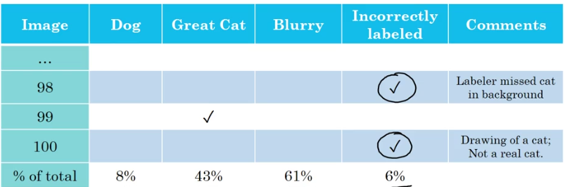
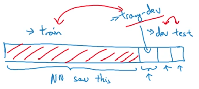
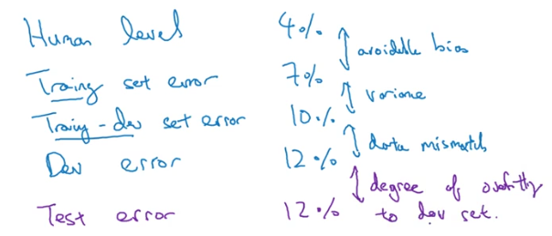
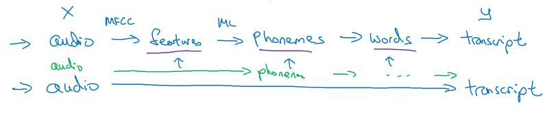

# Specialisation 3: Structuring Machine Learning Projects

___

## WEEK 1

### Orthogonalisation
In machine learning, we have the following assumption:

* Fit training set on cost fucntion.
* Fit dev set well on cost function.
* Fit test set well on cost function.
* Performs well in the real world.

For each one of these assumptions, we have a set of techniques specific to each one, and only one of them, like a bigger network for fitting the train set or regularization for fitting the dev set, but we must not combine different ones, if so adjusting for one assumption without affecting the rest becomes quit difficult. Like early stopping, which can affect both fitting the train and dev set.

Another instance of orthogonalization:
1. Define a metric to evaluate the model.
2. Worry separately about how to do well on this metric.

### Metrics

**F1 score:** sometimes it is hard to differential between two classifiers based on the precision and recall at the same time, to simply the task, we can use the F1 score, which is the harmonic mean of P and R: $\frac{2 PR}{P + R}$.

**Different metrics:** Having different evaluation metrics makes it harder to quickly choose between two different algorithms, and will slow down the speed with which we can iterate. so for that sometimes we can combine different metrics, for N metrics, we can choose 1 metric to optimize and N - 1 to satisfy (optimizing for accuracy and satisfying a running time < 100ms).

### Train / Dev / test set
Choose a dev set and test set to reflect data we expect to get in the future and consider important to do well on. Like adding new data to the test set, which is coming from a different distribution of the original examples, this would cause the dev and test set distributions to become different. This is a bad idea because we're not aiming where we want to hit.

Splitting: Given that the data sets in the deep learning era are much bigger, it is reasonable to have a 98% / 1% / 1% split, the important thing is to set the test set to be big enough to give high confidence in the overall performance of the system.

### Comparing to human-level performance

The model performences can increase rapidly until achieving human like performances, and then the slop of progress becomes very small and we beome close to the bayes optimal error, but so long as the model's performance is worse than humans, we can get labeled data from humans, gain insight from manual error analysis, and apply a better analysis of bias/variance. 

Sometimes, even with a very good model, we can't get to 100% performance, given that for some examples, we might have a high degree of noise that we can't make a correct classification; this is the bayes optimal error: Bayes error is the lowest possible prediction error that can be achieved and is the same as irreducible error. If one would know exactly what process generates the data, then errors will still be made if the process is random. This is also what is meant by "y is inherently stochastic".

- *The avoidable bias:* difference of error between human level performance and training set, can be reduced using a bigger model, training the model for longer, better optimization algorithm, better NN architecture.

- *Variance:* the error difference between the train and dev set, can be reduced using more data, regularization techniques or hyperparameters search.

Two fundamental assumptions of supervised learning:

1. We can fit the training set pretty well.
2. The training set performance generalizes pretty well to the dev/test set.

___

## WEEK 2

### Error analysis
We start with the simplest possible algorithm to avoid premature optimization, one that we can implement quickly, after implementing it and testing it on the cross-validation set, we plot Learning Curves to decide if more data features is likely to help, after that we can do Bias/Variance analysis and *Error Analysis*:

* Manually examining the examples (in the Cross-Validation set) that the algorithm misclassified.
* See if we spot any systematic trend in what types of examples it makes errors on.

Manually examining mistakes that the algorithm is making can give us insights into what to do next. This process is called error analysis. Take for example, we built a cat classifier showing 10% test error and observe that the algorithm was misclassifying dog images as cats. Should we try to make the cat classifier do better on dogs?

**Which Error to Fix?** Well, rather than spending a few months doing this, only to risk finding out at the end that it wasn't that helpful, we can apply an error analysis procedure that can let us very quickly tell whether or not this could be worth your effort.

1. Get ~100 mislabeled dev set examples,
2. Count up how many are dogs,
3. If we only have 5% dog pictures and you solve this problem completely, the error will only go down from 10% to 9.5%, max!
4. If, in contrast, we have 50% dog pictures, you can be more optimistic about improving your error and hopefully reduce it from 10% to 5%

This is how we evaluate single idea of error fixing. In a similar fashion, we can evaluate multiple ideas by creating a grid and selecting the idea that best improves the performance.

  

Correcting incorrect dev/test set examples:

* Apply some process to the dev and test sets to make sure they continue to come from the same distribution.
* Consider examining examples the algorithm got right as well as the ones it got wrong.
* Examples may come from slightly different distributions.

### Mismatched training and dev/test data

If we have two datasets comming from two slightly different distributions, one of them is the target dataset, it is better to use the target dataset in the dev/test sets, and the combine the rest with the slightly different dataset for training.

Example: we have 10,000 images of phone images of cats (target), and 100,000 one from the web (to aid the training), the distribution will be: 105,000 in the training set, and the rest of the target dataset will be split beween dev and test, 2500 each.

One problem this poses, is that we evaluate our model in a different distribution making it hard to do a variance/bias analysis. A possible solution is creating a new set, train-dev which has the same distribution as the train set :

   

Using this new partition, we can do our bias/variance analysis :

    

**Adressing data mismatch:**
* Cary out manual error analysis to try to understand the difference between training and dev/test sets.
* Make training data more similar (artificial data synthesis), or collect more data similar to dev/test sets.

### Learning from multiple tasks

**Transfer learning** is a popular approach in deep learning, where pre-trained models are used as the starting point on computer vision and natural language processing tasks, given the vast compute and time resources required to develop neural network models on these problems and from the huge jumps in skill that they provide on related problems.

The three major Transfer Learning scenarios look as follows:

1. *ConvNet as fixed feature extractor.* Take a ConvNet pretrained on ImageNet, remove the last fully-connected layer (this layer’s outputs are the 1000 class scores for a different task like ImageNet), then treat the rest of the ConvNet as a fixed feature extractor for the new dataset.
2. *Fine-tuning the ConvNet.* The second strategy is to not only replace and retrain the classifier on top of the ConvNet on the new dataset, but to also fine-tune the weights of the pretrained network by continuing the backpropagation.
3. *Pretrained models.* Since modern ConvNets take 2-3 weeks to train across multiple GPUs on ImageNet, it is common to see people release their final ConvNet checkpoints for the benefit of others who can use the networks for fine-tuning.

**When and how to fine-tune?** This is a function of several factors, but the two most important ones are the size of the new dataset (small or big), and its similarity to the original dataset (e.g. ImageNet-like in terms of the content of images and the classes, or very different, such as microscope images).

Transfer learning from Task A to B makes sense when:

* Task A and B have the same input x.
* We have a lot more data for Task A than Task B.
* Low level features from A could be helpful for learning B.

**Multitask learning**
We typically care about optimizing for a particular metric, whether this is a score on a certain benchmark or a business Key Performance Indicator (KPI). In order to do this, we generally train a single model or an ensemble of models to perform our desired task. We then fine-tune and tweak these models until their performance no longer increases. While we can generally achieve acceptable performance this way, by being laser-focused on our single task, we ignore information that might help us do even better on the metric we care about. Specifically, this information comes from the training signals of related tasks. By sharing representations between related tasks, we can enable our model to generalize better on our original task. This approach is called Multi-Task Learning (MTL).

When multi-task learning makes sense:

* Training on a set of tasks that could benefit from having shared lower-level features
* Usually: Amount of data you have for each task is quite similar.

### End to end learing

Traditionally, we extract pre-defined features before prediction.

    data -> extracted features -> learning algorithm -> output

However, hand-engineered features limit the potential performance as some of them are poor approximation of reality and some of them throw away some information.

End-to-end learning means that we replace the pipeline with a single learning algorithm so that it goes directly from the input to the desired output to overcome limitations of the traditional approach.

    data -> learning algorithm -> output

End-to-end learning system tend to do better when there is a lot of labeled data as the learning algorithm can somehow learn features by itself. When the training set is small, it tends to do worse than hand-engineered pipeline.

Speech recognition example:

  

Pros of end-to-end deep learning:

* Let the data speak.
* Less hand-designing of componenets needed.

Cons :

* May need large amount of data
* Excludes potentially useful hand-designed components.