# Specialisation 4: Convolutional Neural Networks


<!-- TOC -->

- [Specialisation 4: Convolutional Neural Networks](#specialisation-4-convolutional-neural-networks)
      - [WEEK 1](#week-1)
            - [Edge Detection](#edge-detection)
            - [Padding](#padding)
            - [Convolutions](#convolutions)
                  - [Strided convolutions](#strided-convolutions)
                  - [Convolutions over volume](#convolutions-over-volume)
                  - [Pooling layers](#pooling-layers)
                  - [Global average pooling](#global-average-pooling)
                  - [Convolutional layer backward pass](#convolutional-layer-backward-pass)
      - [WEEK 2: Case studies](#week-2-case-studies)
            - [LeNet 5](#lenet-5)
            - [AlexNet](#alexnet)
            - [VGG-16](#vgg-16)
            - [ResNets](#resnets)
                  - [Identity block](#identity-block)
                  - [The convolutional block](#the-convolutional-block)
            - [Networks in Networks](#networks-in-networks)
            - [Inception](#inception)
            - [Practical advies](#practical-advies)
      - [WEEK 3](#week-3)
            - [Object localization](#object-localization)
            - [Landmark detection](#landmark-detection)
            - [Object detection](#object-detection)
                  - [Sliding window](#sliding-window)
                  - [Bounding box prediction](#bounding-box-prediction)
                  - [Intersection Over Union](#intersection-over-union)
                  - [Anchor Boxes](#anchor-boxes)
                  - [Region Proposals](#region-proposals)
            - [YOLO](#yolo)
      - [WEEK 4](#week-4)
            - [Face recognition](#face-recognition)
                  - [One shot learning](#one-shot-learning)
                  - [Siamese Network](#siamese-network)
                  - [Triplet loss](#triplet-loss)
                  - [Face Verification and Binary Classification](#face-verification-and-binary-classification)
            - [Neural style transfer](#neural-style-transfer)
                  - [Cost functions](#cost-functions)
                  - [Content cost function](#content-cost-function)
                  - [Style cost function](#style-cost-function)
            - [1D & 3D convolutions](#1d--3d-convolutions)

<!-- /TOC -->

___

## WEEK 1

### Edge Detection
A problem of fundamental importance in image analysis is edge detection. Edges characterize object boundaries and are therefore useful for segmentation, registration, and identification of objects. A typical application where edge detection techniques are involved is automatic character recognition.

Edges in an image are pixel locations with abrupt changes in gray levels. If we had a continuous image (i.e., assuming continuous values), we would say that the derivative of the image f(x,y) assumes a local maximum in the direction of the edge. Therefore, one edge detection technique is to measure the gradient of f in a particular location. This is accomplished by using a gradient operator.  Such operators, also called filters, provide finite-difference approximations of the orthogonal gradient vector fx and fy.

Let H denote a p x p filter and x(m,n) denote an arbitrary image location. The gradient operators are represented by a pair of filters, H1 and H2, which measure the gradient of the image x(m,n) in the two orthogonal directions. Common gradient operators:

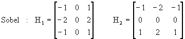

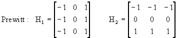

Once we have computed the gradient values, we can combine them to obtain the gradient vector magnitude. Finally, we decide that the pixel (m,n) for which we have calculated the gradient vector magnitude g(m,n) is an edge location if the gradient vector magnitude is sufficiently large (i.e., larger than a certain threshold t).

There are other ways to perform edge detection. Such as Laplacian. The Laplacian method searches for zero crossings in the second derivative of the image to find edges.

### Padding

To avoid shrinking the output image, and throwing away information from the edge (will be used only to calculate the output for one pixel, with one padding, it'll effect 4 pixels) we have the following possibilities:

* Valid convolution: No padding, after convolving (nxn) image * (fxf) filter -> n-f+1 x  n-f+1.
* Same convolution: Pad so that the output size is the same as the input size. the ouput size is (n+2p-f+1) x (n+2p-f+1), we can find the number of pixels to pad by fixing n = n+2p-f+1. We find p = (f-1)/2, f is generally an odd number.

So, the main benefits of padding are the following:

- It allows us to use a CONV layer without necessarily shrinking the height and width of the volumes. This is important for building deeper networks, since otherwise the height/width would shrink as we go to deeper layers. An important special case is the "same" convolution, in which the height/width is exactly preserved after one layer.

- It helps us keep more of the information at the border of an image. Without padding, very few values at the next layer would be affected by pixels as the edges of an image.

### Convolutions

#### Strided convolutions

Using strided convolutions, for an input image of size nxn, and a filter of size fxf, we get an output of size :

<p align="center"> 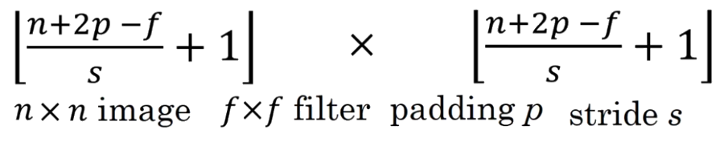 </p>

In the formal diffinition of convolutions, we first take the filter and flip it in both the vertical and horizental axis, before applying the convolution operation, what we're actually using in deep learning is **cross-correlation**. Originaly, with the flipping operation, the convolution operation becomes an associative operation (A\*B)\*C = A\*(B\*C)

*Cross-correlation* Given an input image I and a filter (kernel) K of dimensions k1×k2, the cross-correlation operation is given by:

<p align="center">  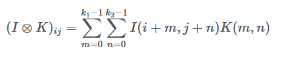 </p>

*Convolution*
Given an input image I and a filter (kernel) K of dimensions k1×k2, the convolution operation is given by:

<p align="center"> 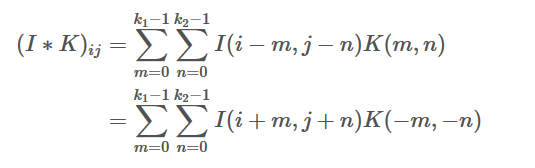 </p>

it is easy to see that convolution is the same as cross-correlation with a flipped kernel i.e: for a kernel K where K(−m,−n)==K(m,n).

**Why convolutions?**

* Parameter sharing: A feature detector (such as vertical edge detector) that's useful in one part of the image is probably useful in another part of the image.
* Sparsity of connection: In each layer, each output layer depends only on a small number of inputs.
* Capturing translation invariance.

#### Convolutions over volume

We convolve an image of size H x C x W by a filters (F x F x W) x N_filters and we get as an output: (H-f+1) x (W-f+1) x N_filter (in case no padding and no stride)

<p align="center"> 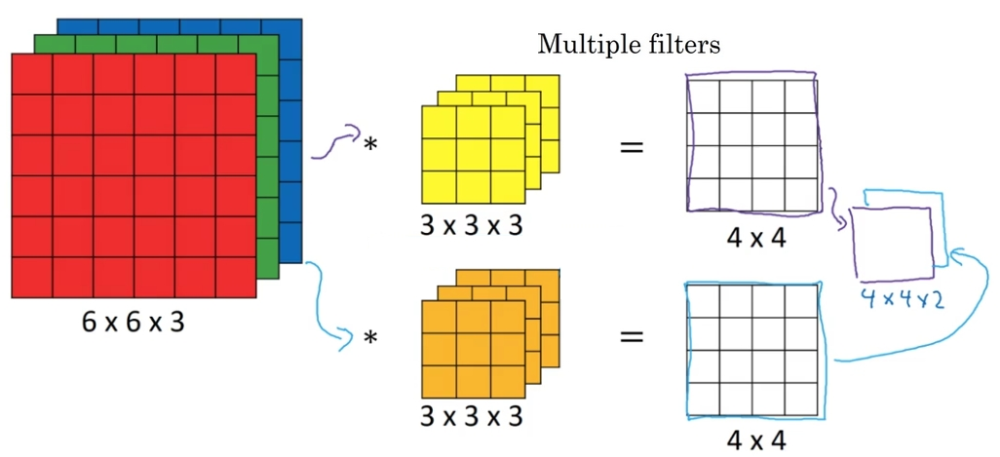</p>

To construct one layer of convolutionnal network, given a number of 3D filters, after convolving the input and obtaining a 3D volution where the depth = number of filter, we add biases to each one and apply a non linearity:

<p align="center"> 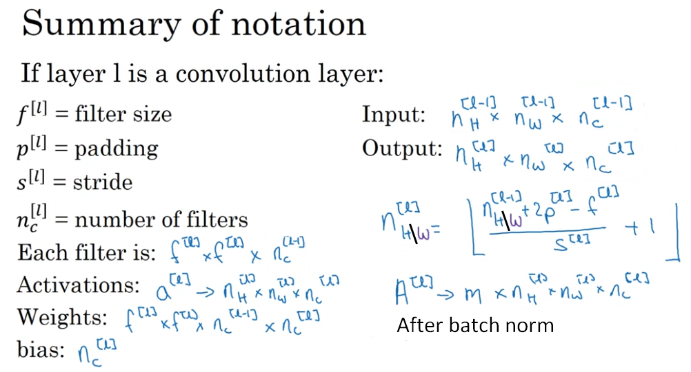</p>

#### Pooling layers

The pooling (POOL) layer reduces the height and width of the input. It helps reduce computation, as well as helps make feature detectors more invariant to their position in the input. The two types of pooling layers are:

- Max-pooling layer: slides an (f, f) window over the input and stores the max value of the window in the output.
- Average-pooling layer: slides an (f, f) window over the input and stores the average value of the window in the output.

The pool layers are in charge of downsampling the spatial dimensions of the input. The most common setting is to use max-pooling with 2x2 receptive fields (i.e. F=2), and with a stride of 2 (i.e. S=2). Thus discarding exactly 75% of the activations in an input volume (due to downsampling by 2 in both width and height). Another slightly less common setting is to use 3x3 receptive fields with a stride of 2, but it is very uncommon to see receptive field sizes for max pooling that are larger than 3 because the pooling is then too lossy and aggressive. This usually leads to worse performance.

#### Global average pooling

GAP is used as replacement to the traditional fully connected layers in CNN. The idea is to generate one feature map for each corresponding category of the classification task in the last mlpconv layer. Instead of adding fully connected layers on top of the feature maps, we take the average of each feature map, and the resulting vector is fed directly into the softmax layer.  One advantage of global average pooling over the fully connected layers is that it is more native to the convolution structure by enforcing correspondences between feature maps and categories. Thus the feature maps can be easily interpreted as the confidence maps of the categories.  Another advantage is that there is no parameter to optimize in the global average pooling thus overfitting is avoided at this layer.  Futhermore, global average pooling sums out the spatial information, thus it is more robust to spatial translations of the input. We can see global average pooling as a structural regularizer that explicitly enforces feature maps to be confidence maps of concepts (categories).

An example of GAP, With a 3D 8,8,10 tensor, we compute the average over the 8,8 slices, we end up with a 3D tensor of shape 1,1,10 that we reshape into a 1D vector of shape 10. And then we add a softmax operator without any operation in between. The tensor before the average pooling is supposed to have as many channels as as the number of classes we're trying to detect (we can always use conv 1x1 to adjust the depth of the feature maps).

**CNN architecture example, LeNet 5:**
<p align="center"> </p>

#### Convolutional layer backward pass

**Computing dA:**

This is the formula for computing  with respect to the cost for a certain filter  and a given training example:


Where  is a filter and  is a scalar corresponding to the gradient of the cost with respect to the output of the conv layer Z at the hth row and wth column (corresponding to the dot product taken at the ith stride left and jth stride down). At each time, we multiply the the same filter  by a different dZ when updating dA. We do so mainly because when computing the forward propagation, each filter is dotted and summed by a different slice of the activation (when we do a sliding window). Therefore when computing the backprop for dA, we are just adding the gradients of all the activation slices.

<p align="center"> 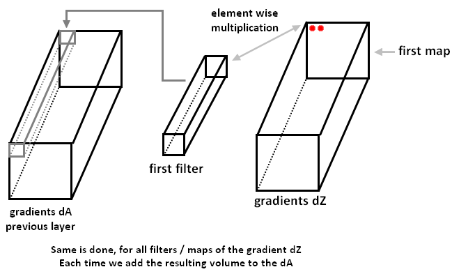</p>

**Computing dW:**

This is the formula for computing  ( is the derivative of one filter) with respect to the loss:


Where  corresponds to the slice which was used to generate the acitivation . Hence, this ends up giving us the gradient for  with respect to that slice. Since it is the same , we will just add up all such gradients to get .

**Computing db:**

This is the formula for computing  with respect to the cost for a certain filter :


db is computed by summing . In this case, you are just summing over all the gradients of the conv output (Z) with respect to the cost.

Here is a more infomative picture for computing the gradients with respect to the weights [source](https://becominghuman.ai/back-propagation-in-convolutional-neural-networks-intuition-and-code-714ef1c38199): 


___

## WEEK 2: Case studies


### LeNet 5

<p align="center"> 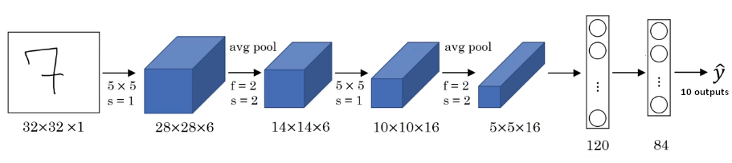</p>

A modern version will use softmax with 10 outputs instead of Gaussian connections, the network has 60k parameters, generally the spatial dimension nh and nw are reduced while nc is increased.

In this paper they use sigmoid/tanh, and the non lienarity is applied after pooling, and the filters are not applied to all the channels, but only a specific channels to reduce computation.

### AlexNet

<p align="center"> </p>

The nework is quite similar to LeNet5, but this time it is much bigger, with 60M parameters, and the non linearity used is ReLU, and some tricks to train the network on two GPUs: *The parallelization scheme that we employ essentially puts half of the kernels (or neurons) on each GPU, with one additional trick:  the GPUs communicate only in certain layers.  This means that, for example, the kernels of layer 3 take input from all kernel maps in layer 2. However, kernels in layer 4 take input only from those kernel maps in layer 3 which reside on the same GPU. Choosing the pattern of connectivity is a problem for cross-validation, but this allows us to precisely tune the amount of communication until it is an acceptable fraction of the amount of computation.*

They also use Local Response Normalization (LRN): *ReLUs have the desirable property that they do not require input normalization to prevent them from saturating. If at least some training examples produce a positive input to a ReLU, learning will happen in that neuron.  However, we still find that the following local normalization scheme aids generalization.* So each neurone in a spatial dimension (x,y) is normalized by the sum of n adjacent kernel maps at the same spatial position, where n is the number of kernels in that layer.

### VGG-16

<p align="center"> 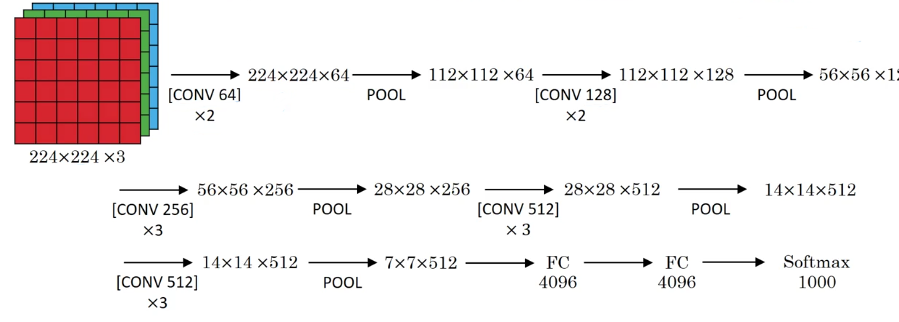</p>

16 refers to the number of layers containing trainable parameters, 13 CONVs, 2 FC and one softmax.

In this architecture, we focus on using only 3x3 filters and doubling number of filters: nw/nh goes down by 2 and nc goes up by two, stride of one, and SAME padding with maxpooling is applied. The total number of parameters are 138M parameters, but the simplicity of the network makes it quite easy to implement and use.

### ResNets

The main benefit of a very deep network is that it can represent very complex functions. It can also learn features at many different levels of abstraction, from edges (at the lower layers) to very complex features (at the deeper layers). However, using a deeper network doesn't always help. A huge barrier to training them is vanishing gradients: very deep networks often have a gradient signal that goes to zero quickly, thus making gradient descent unbearably slow. More specifically, during gradient descent, as we backprop from the final layer back to the first layer, we are multiplying by the weight matrix on each step, and thus the gradient can decrease exponentially quickly to zero (or, in rare cases, grow exponentially quickly and "explode" to take very large values).

<p align="center"> 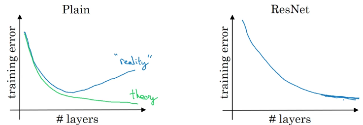</p>

Resnets introduce skip connections to solve the problem of vanashing and exploding gradients that occur in very large neworks. Allowing to obtain better performances with deeper networks.

<p align="center"> 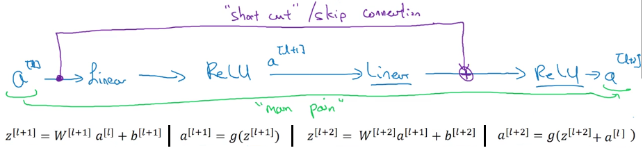</p>

With the use of skip connection, we assure that in the worst case the network will learn the identiy function (al>0 after Relu, so after the skip connection we have g(z(l+2)*w + al), if w = 0 then g(al)= al) and the performances will not be reduced after adding more layers, sometimes, the skip connection might use conv layers in between to adjust the dimension of the previous activation before forwarding them to the upcoming layer.

#### Identity block

The identity block is the standard block used in ResNets, and corresponds to the case where the input activation (say a[l]) has the same dimension as the output activation (say a[l+2]). To flesh out the different steps of what happens in a ResNet's identity block, here is an alternative diagram showing the individual steps:

There is a slightly more powerful version of skip connection, that is over 3 hidden layers.

<p align="center"> 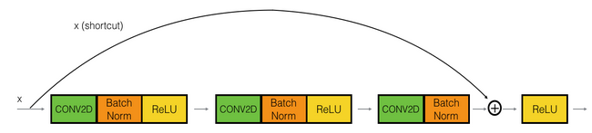</p>

First component of main path:

- The first CONV2D has  filters of shape (1,1) and a stride of (1,1).
- The first BatchNorm is normalizing the channels axis.
- Then we apply the ReLU activation function.

Second component of main path:

- The second CONV2D has  filters of shape  and a stride of (1,1). Its padding is "same".
- The second BatchNorm is normalizing the channels axis.
- Then we wapply the ReLU activation function.

Third component of main path:

- The third CONV2D has  filters of shape (1,1) and a stride of (1,1).
- The third BatchNorm is normalizing the channels axis.

Final step:
- The shortcut and the input are added together.
- Then we apply the ReLU activation function.

#### The convolutional block

<p align="center"> 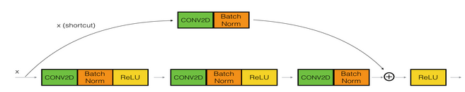</p>

The CONV2D layer in the shortcut path is used to resize the input xx to a different dimension, so that the dimensions match up in the final addition needed to add the shortcut value back to the main path.

Resnet network:
<p align="center"> </p>
<p align="center"> 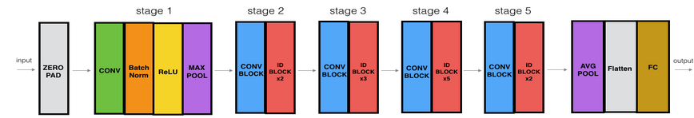</p>

### Networks in Networks

1x1 convolutions makes sense when it is applied to a 3d volume of activations, so that each element of the output contains information extracted from all the neurons with the same spacial dimensions (x,y) but spanning over all depth of the volume.

One of the applications is to reduce the number of channels of a given volume.

<p align="center"> 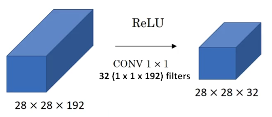</p>

### Inception

Instead of choosing just one type of convolution, we can apply different convolutions and pooling and stack them up.

<p align="center"> 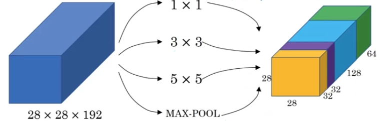</p>

The problem with such block, is the computation cost, for an input volume of size (28x28x192) and 32 filters (5x5), we have and an ouput of size (28x28x32), so the number of computations are : (28x28x32) x (5x5x192) = 120M

To reduce the cost we can first apply 1x1 convolution to reduce the depth of 192: called **bottleneck layer**, and then apply the 5x5 convolutions.

<p align="center"> 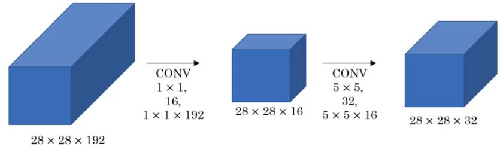</p>

This time the number of computation are: (28x28x16) x 192 + (28x28x32) x (5x5x16) = 12.4M, the computation is thus greatly reduced.

Inception network: We can use these blocks; 1x1 convolutions to reduce the computation and then different convolutions and pooling layers that are then concatenated to give the output volume.

<p align="center"> 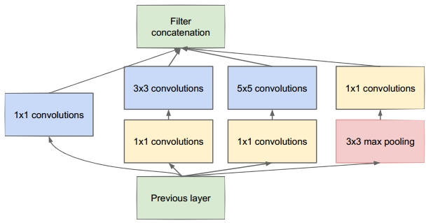</p>

The inception network contain a succesion of these blocks, ending with a fully connected layers and a softmax, in the paper they also use lateral output layers to do predictions based on the earliers layers.

### Practical advies

* *Transfer learning:* It is always better to use pretrained networks for our task, either by eliminating the softmax layer and replacing it with a new one, and all the previous layers become fixed, and we can even compute the last activation for all the training examples and save them to disk to reduce the computations, or fine tune the last layers or even the whole network if we have enough data.
* *Data augmentation:* Given that we often do not have enough data, data augmentation techniques help a lot: Mirroring, Random Cropping, Rotation, Shearing, Local warping, Color shifting (PCA color augmentation). This is implemented using some CPU threads to do data augmentation and data preparation and feed it to other GPU threads for training the network.

**PCA color augmentation:** For every image each pixel is a data point which is having 3 vectors: R,G,B. We can compute co-variance matrix of these vectors in order to compute the PCA. If we take 3x3 matrix size, computing PCA results in 3 vectors with 3 components. We can then sample 3 scale parameters, and add scaled versions of each of these 3 vectors to all pixels in the image. For best results we should also scale them by the corresponding eigenvalues. This will perturb the image colors along these PCA axes.

___

## WEEK 3

### Object localization

In image classification, the main task is to classify the main object present in the image, in object localization, the objectif is to also predict the localization of the main object, using a bounding box.

Now, instead of outputing the class predictions (N classes + background/no class), a four coordinates are also predicted.

y = [Pc bx by bh bw C1 C2 C3], C1..C3 are the class probabilities, bx..bw are the bounding box coordianates, and Pc is the probability that an object is present in the image or not, if not, the other fields are not considered (? "dont cares").

The loss in this case can be log likelihood for the class predictions, and L2 loss for bounding box, and for Pc we can use logistic regression loss.

### Landmark detection

Instead of outpting a 4 coordinates of the bounding boxes, we can train the network to output a specific number positions of our choosing in the image, such as human poses and human face detection.

<p align="center"> 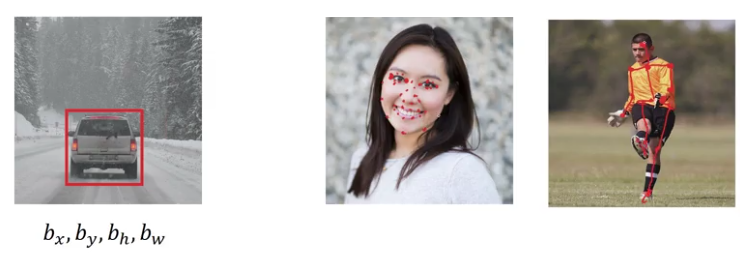</p>

### Object detection

In object detection, the goal is to output a bounding box over all the object of interest in the image, and not limit the output to only the main object.

#### Sliding window

One possibility is to use a sliding windows (with varying sizes and ratios) over the image, each time, we crop the specific window of the image and forward the crop into a CNN and predict the coresponding class, but the downside of such method is the great computationnal cost.

It turns out, that siliding windows can be implemented very efficiently using convolutionnal nets, but first we need to replace the fully connected layer by convolutionnal layers, this is done using 1x1 filters, where the number of the filter correctponds to the number of the neurones in the FC layers, and given that each one 1x1 filter will span the whole input volume, the two are mathematicaly equivalent.

<p align="center"> 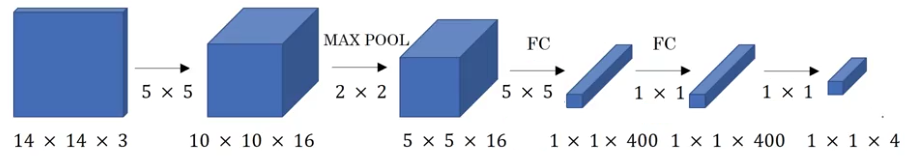</p>

Let's consider in this example, that we're intrested in having a sliding window of size 14x14 over the image, for a given image with the same size as the sliding window, the output is of spatial dimension 1x1 and depth corresponding to the number of classes (here 4 classes).

<p align="center"> 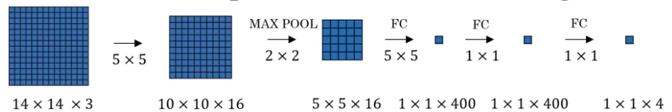</p>

Now if the image is of different size, it turns out, that after applying the same convolutions, the output size corresponds to the number of sliding windows over the original image, for 16x16 image, there is 4 possible sliding windows, so the outputs is of size 2x2x4, 2x2 giving the ouputs of the four possible sliding windows, each one with four outputs, one for each class.

<p align="center"> 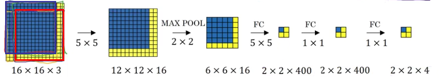</p>

The same thing applies for bigger images, like 28x28 image

<p align="center"> 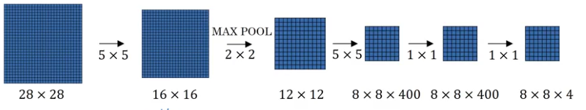</p>

#### Bounding box prediction

The problem with the previous approach, is that there is a large number of possible bounding boxes in the image where the object might be present, and the window does not match exactly the object.

YOLO proposes a solution to this problem, by dividing the input image into a grid; say 3x3 grid or even 19x19 grid for finer detection, and for each grid we do a simple object localization, where the network output the class probabilities and box coordinates of the main object in the cell, for each grid cell, the network is assigned the task of detecting the object for which its center belong to that grid cell, even is the object spans different grid cells (the cars in the example bellow).

<p align="center">  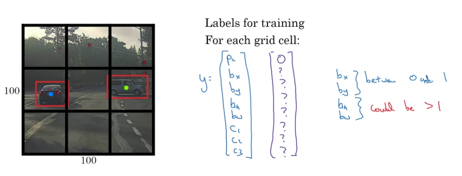</p>

For each grid cell, the network ouputs a vector of size (5 + #Classes), the probability of the presence of a given object (Pc), and bounding box coordinates and the probabilities for each class. So the ouput of the CNN will be a volume of size GxGX(5 + #Classes), where GxG is the number of grids chosen, in this example, the output is 3x3x8.

Given that the object is assigned to the grid cell containing the center of its bounding box, bx and by are always < 1 (sigmoid is used), and bw and bh can be greater than one given that some object might span different cells. And bx, by, bw and bh are always relative to the given cell coordiantes.

#### Intersection Over Union

Intersection of two boxes / their union, is a way to measure how close are predicted bounding boxes (bb) to the ground truth one, IoU is used to measure the overlap between two bb, if IoU > Some threshold, like 0.5, the bb is considered correct.

<p align="center"> 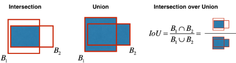</p>

**Non-max Suppression**: Given that even if only one object is assigned to one grid cell, with a dense grid (say 19x19), neighboring grids may also localize the object in question, non max suppression is a mechanism to supress the similar predicted bb that are referencing the same object and keeping only the most confident bb.

This is done as follows (# Classes = 1 in this example)

<p align="center"> 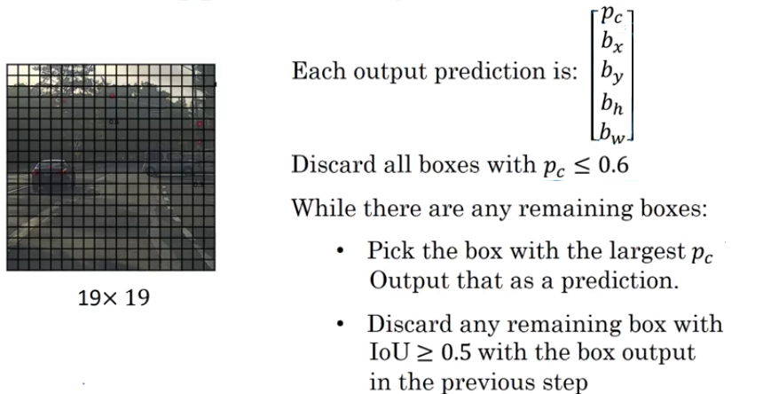</p>

#### Anchor Boxes

The problem with the previous appraoch, each object in training image is assigned to grid cell that contains that object's midpoint, so one grid cell can only detect one object even if we assign multiple objects to the same grid cell.

To solve this problem, we define anchor boxes, with predefined size and ratios to every single grid cell, and now the CNN will output (5 + #Classes) x #Anchors for each grid cell.

With two anchor boxes, each object in the training image is assigned to grid cell that contains object's midpoint and anchor box for the grid cell with the highest IoU.

<p align="center"> 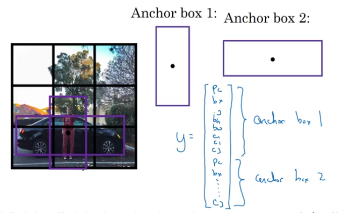</p>

When constructing the training labels, we assign a given object to a given cell and to a given anchor in the cell depending on the IoU, if for a given cell does not contain any object, which is the case in many grid cells, we assign Pc to 0 and the rest to *dont cares*. And we can expect a similar thing when doing predicitions.

<p align="center"> 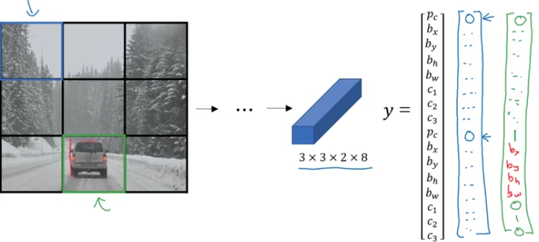</p>

We can choose the ratios and sizes of anchor boxes either by hand, or by using K-means over the training examples to find the sizes that are most common.

#### Region Proposals

Instead of defining anchor boxes over all the images and predicting the object, with R-CNN, we first apply selective search, which is a segmentation algorithm, and then define possible boxes based on the segmentation blobs, and then run CNN for each box to detect if an object is present or not.

The problem with R-CNN is the computational requirements to run the CNN each time for each box, over the years their have been a few improvements :

* R-CNN: Propose regions, classify proposed regions one at a time, output label & a more precise bounding box.
* Fast-RCNN: Propose regions using selective search, use convolution implementation of siliding windows to classify all the proposed regions.
* Faster-RCNN: Use conv nets to propose regions.

### YOLO

YOLO ("you only look once") is a popular algorithm because it achieves high accuracy while also being able to run in real-time. This algorithm "only looks once" at the image in the sense that it requires only one forward propagation pass through the network to make predictions. After non-max suppression, it then outputs recognized objects together with the bounding boxes.

<p align="center"> 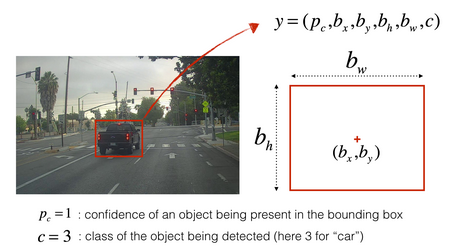</p>

**Model details:**

First things to know:

- The **input** is a batch of images of shape (m, H, W, 3)
- The **output** is a list of bounding boxes along with the recognized classes. Each bounding box is represented by 6 numbers  as seen above. If we expand C into an 80-dimensional vector, each bounding box is then represented by 85 numbers.

With 5 anchor boxes. YOLO architecture is the following: ```IMAGE (m, H, W, 3) -> DEEP CNN -> ENCODING (m, 19, 19, 5, 85)```. for simplicity the last two dimension are flattened to get : (m, 19, 19, 425)

<p align="center"> 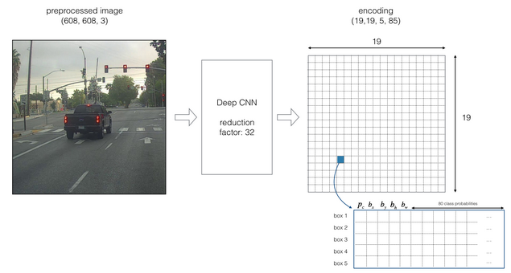</p>

To extract the probability that the box contains a certain class, the probabilities for each class Ci is multiplied by the probability if an object is present in the cell.

<p align="center"> 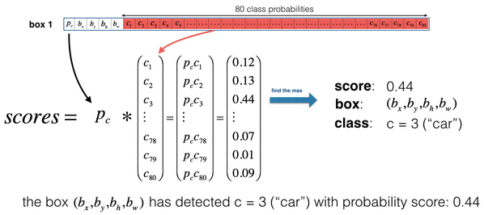</p>

one way to visualize what YOLO is predicting on an image:

- For each of the 19x19 grid cells, find the maximum of the probability scores (taking a max across both the 5 anchor boxes and across different classes).
- Color that grid cell according to what object that grid cell considers the most likely.

Doing this results in this picture:

<p align="center"> 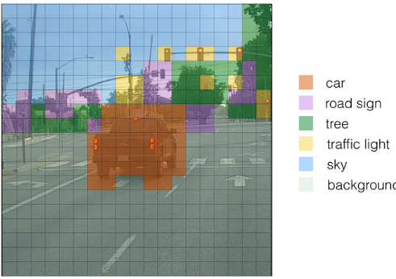</p>

___
## WEEK 4

### Face recognition

Face verification vs. face recognition:

*Verfication*:

* Input image, name/ID.
* Ouptut whether the input image is that of the claimed person.

*Recognition*:

* Has a database of K persons.
* Get an input image
* Output IF if the image is any of the persons, 'not recognized' otherwise.

#### One shot learning

With face recognition using CNN with an input as the person's image, and outputs is a softmax a label over K persons, one of the difficulties in such approach is being able to train the model using only one traning example for each person (K person in the database), this is called **One shot learning**. We also need to retain our model each time we add a new person to the database, and in test time we need to compare the input to all the databases instances.

One possible solution, is learning a similarity function, the nework takes an inputs two images and ouputs the similarity between the two:

d(img1, img2) = degree of difference between images:

- d(img1, img2) < threshold : Same person
- d(img1, img2) > threshold : Not

#### Siamese Network

To learn a similarity function, we use a Siamese Network, which take as input a given image and outputs an encoding f(x) (e.g. a vertor of 128), the goal is to be able to ouput two similar encodings if the two inputs are images are of the same person.

<p align="center"> 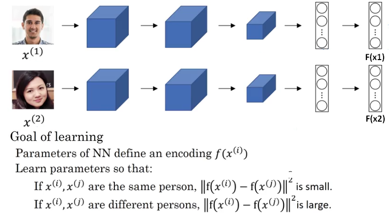</p>

#### Triplet loss

A possible way to train such network is to use a Triplet loss, the network will take as input, three images, the Anchor A, Positive P, which is an image of the same person as A, and Negative N (a different person), and the objective is to ouput three encodins, given the difference between the encodings of A and N are at least larger than a margin Alpha compared to the difference between the encodings of A and P.

<p align="center"> <p align="center"> 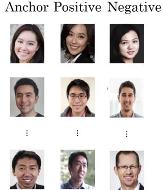</p>


We add a margin alpha, so that the network learn to differentiate between the images, and not only input 0 encodings which will satisfy the learning condition, Alpha is a hyperparameter (e.g. 0.5).

So, an encoding is a good one if:

- The encodings of two images of the same person are quite similar to each other,
- The encodings of two images of different persons are very different (at least a difference of alpha).

The triplet loss function formalizes this, and tries to "pull" the encodings of two images of the same person (Anchor and Positive) closer together, while "pushing" the encodings of two images of different persons (Anchor, Negative) further apart.

Training will use triplets of images :  

- A is an "Anchor" image--a picture of a person.
- P is a "Positive" image--a picture of the same person as the Anchor image.
- N is a "Negative" image--a picture of a different person than the Anchor image.

These triplets are picked from our training dataset. We write  to denote the i-th training example.

We'd like to make sure that an image  of an individual is closer to the Positive  than to the Negative image  by at least a margin :


We would thus like to minimize the following "triplet cost":


Here, we are using the notation "" to denote .  

**Chosing the triplets A, P and N:** During training, if A, P and N are chosen randomly, the chances are N and P will be very different and   is easily satisfied. So it is better to choose similar P and N, so that they're hard to train on: .

For this loss to work, we'll need to have more than one example for each person in the training set, to construct triplet APN.

#### Face Verification and Binary Classification

There is an alternative to the triplet loss, we can formulate the face recognition problem as binary classification problem, in which two CNNs compute the encodings of two input images, and use an logistic regression unit to output one if the images are of the same person, and zero otherwise.

<p align="center"> </p>

To train such network, we construct a number of pairs of the same and different persons, and label each pair accordingly. and to reduce computation we can compute the set of features one time and re-use them in production time.

### Neural style transfer

Neural style transfer merges two images, namely, a "content" image (C) and a "style" image (S), to create a "generated" image (G). The generated image G combines the "content" of the image C with the "style" of image S.

<p align="center"> 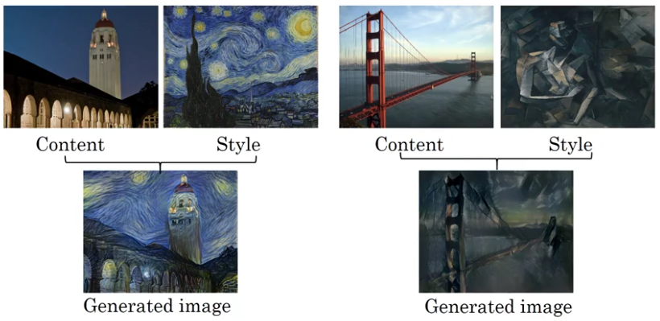 </p>

**What are deep ConvNets learning?** To visualize what the hidden units of different layers are computing, we can pick a unit in a given layer and find the nine image patches that maximises the unit's activation. This is done for different units, in different layers;

<p align="center"> 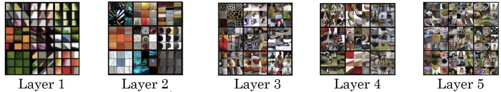 </p>

We see that early layers detects low level features, like edges in different direction and their combinations, and then in later layers, these features are used to detect parts of object and more complex elements of the image (faces, round objects.)

#### Cost functions

We're going to define a cost function, and by minising this cost function by gradient descent we can generate the image G. The loss function contains two terms, one to measure how similar the content of the C image and G image, and same for the style cost function, this time to measure the style between S, and G.


To generate a new image:
1. Initiate G randomly, G: 100 x 100 x 3.
2. Use gradient descent to minimise J(G).

#### Content cost function
Say if we use a hidden layer l to compute content cost, if l is a very small number, we'll force the generated image to have pixel values which are very similar to the content image, and if we choose l to be the last layer, the generated will be forces to have the same objects as the content image, the best choice is choosing a shallow layer, not too early and not too deep.

We use a pre-trained CNN net like VGG, and after choosing a given layer, we compare the activation of the content image and the generated image. Let  be the hidden layer activations in the layer we have chosen. This will be a  tensor. We repeat this process with the image G: Set G as the input, and run forward progation. Let  be the corresponding hidden layer activation. We will define as the content cost function as:


Here,  and  are the height, width and number of channels of the hidden layer, and appear in a normalization term in the cost.  and  are the volumes corresponding to a hidden layer's activations. In order to compute the cost , it might also be convenient to unroll these 3D volumes into a 2D matrix, as shown below. (Technically this unrolling step isn't needed to compute , but it will be good practice for when we need to carry out a similar operation later for computing the style const .)

<p align="center"> 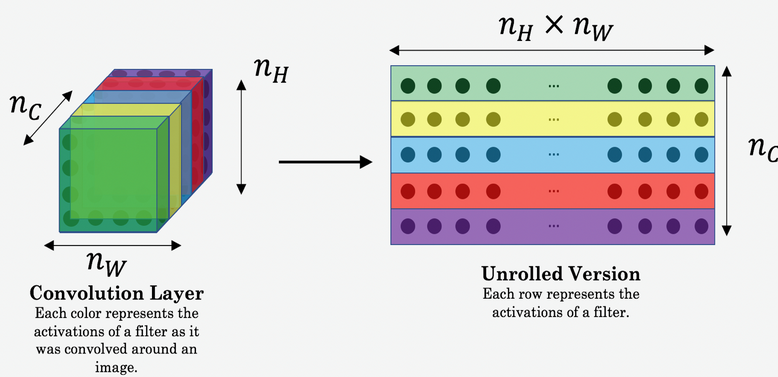 </p>

#### Style cost function

What is the style of an image? one possible way to define the style of a given image is the correlation between the activation across channels. The correlation measure how often high level features accour together. So given an image we'll compute a style matrix (Gram matrix) for both the style image and the generated image, this matrix is of size Nc x Nc, given that we measuer the correlation between every pairs of the activations maps. The style is computed over different layers.

**Gram matrix** The style matrix is also called a "Gram matrix." In linear algebra, the Gram matrix G of a set of vectors  is the matrix of dot products, whose entries are . In other words,  compares how similar  is to : If they are highly similar, you would expect them to have a large dot product, and thus for  to be large.

<p align="center"> 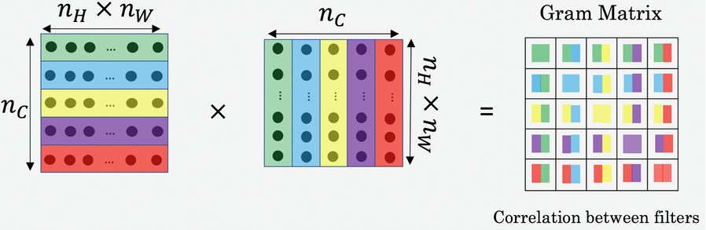 </p>

The result is a matrix of dimension  where  is the number of filters. The value  measures how similar the activations of filter i are to the activations of filter j.

One important part of the gram matrix is that the diagonal elements such as  also measures how active filter i is. For example, suppose filter i is detecting vertical textures in the image. Then  measures how common  vertical textures are in the image as a whole: If  is large, this means that the image has a lot of vertical texture.

By capturing the prevalence of different types of features (), as well as how much different features occur together (), the Style matrix G measures the style of an image.

**Style cost**: After generating the Style matrix (Gram matrix), the goal will be to minimize the distance between the Gram matrix of the "style" image S and that of the "generated" image G. For a single hidden layer , the corresponding style cost for this layer is defined as:


where  and  are respectively the Gram matrices of the "style" image and the "generated" image, computed using the hidden layer activations for a particular hidden layer in the network.  

And then we combine the style costs for different layers as follows:


### 1D & 3D convolutions

We can also apply 1D filters, such as convolving word vectors, each N dimensional input vector is convolved with a given set of 1D m filters (each one is of size f), and the output is of size ((N-f)/stride + 1) * m,

For 3D data, such as medical scans and videos, where the image has also a depth, this time the filters are also three dimensional, so now the input can be of size (H0 x W0 x Volume0) x Nchannles, and the filters are of size (f1 x f2 x f3) x Nchannels, and for m 3D filters, the ouputs will be of size (H1 x W1 x V1) x m.
