# Specialisation 5: Sequence Models

___
## WEEK 1
Sequences are 1D data that comes in form of a sequence, like words and speech.

<p align="center"> 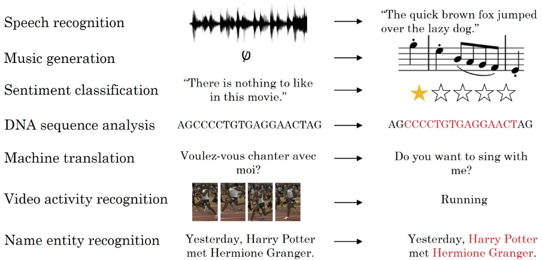</p>

**Notations**
Say we want a network to determine the names present is the input phrases(persons names, companies names... ) So, this is a problem called Named-entity recognition and this is used by search engines for example, the inputs are the words (each one is indexed in the input sequence) with a binary ouput to tell if the word is a name or not.

```
x:     Harry  Potter   and   Hermione Granfer   invented  a    new    spell.
	x<1>  x<2>    x<3>     x<4>     x<5>     x<6>    x<7>  x<8>    x<9>

y:       1      1       0        1        1        0        0    0        0
```

A t-th element of sequence of the input i is indexed as: }$" title="$X^{(i)<t>}$" /> and the length of each input i is written as: $T_x^{(i)}$.

Same for the ouputs, the t-th element of sequence of the ouptut i is }$" title="$Y^{(i)<t>}$" /> and the output sequence length is $T_y^{(i)}$.

So, in summary:
- Superscript  denotes an object associated with the  layer. 
    - Example:  is the  layer activation.  and  are the  layer parameters.

- Superscript  denotes an object associated with the  example. 
    - Example:  is the  training example input.

- Superscript  denotes an object at the  time-step. 
    - Example:  is the input x at the  time-step.  is the input at the  timestep of example $i$.
    
- Lowerscript  denotes the  entry of a vector.
    - Example:  denotes the  entry of the activations in layer $l$.
 
How to represent individual words in the sentence? first we choose a dictonnary containing all the words we're interested in, and then use one hot representation to represent the words in the input sequence. If we encountered words not in the dictionnary, we represent the word as \<unk\> token.

<p align="center"> 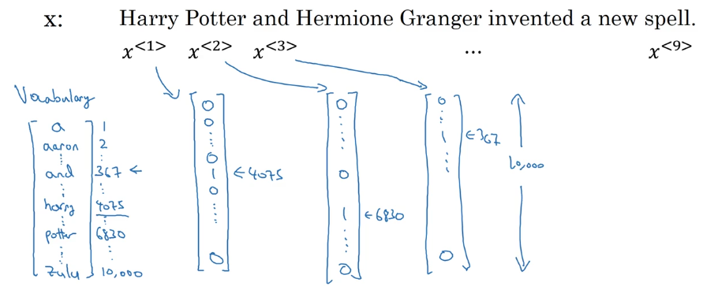</p>

### Recurent neural nets
We could use a standard network, taking as input  words and outputing  outputs, the problems with such approach:
- Inputs and ouputs can be different lengths in different examples.
- Doesn't share features learned across different position of text (the same word reappering in a different position mean the word is also a person's name).
- The length of the inputs are quite big, depending on the size of the dictionnary, so the network will have an enormous number of parameters.

<p align="center">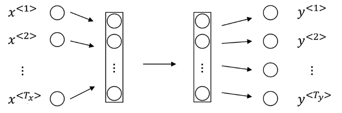</p>

To take into account the nature of sequence data, RNNs use recurrent connections to take as inputs, in addition to the current word in the input sequence, the state at the previous time step. With two weight matrices, Wax (input -> hidden state) and Waa (previous hidden state -> current one) and Wya (hidden state -> output), we generally start the previous hidden state with Zeros.

<p align="center"></p>

A Recurrent neural network can also be seen as the repetition of a single cell. The following figure describes the operations for a single time-step of an RNN cell.

<p align="center">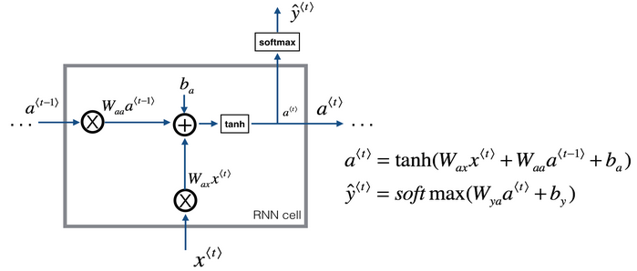</p>

*Side note:* Sometimes, the network might also need to take into account not only the previous words but also the comming words in the sequence for better predictions, per example; "He said, Teddy Roosevelt was a great president", to be able to predict Teddy as a name, having both the previous words and Roosevelt will given the network a better change to classify it as a name. This implemented in Bidirectionnal RNNs.

**Forward propagation :**

&space;}&space;=&space;g&space;\left(&space;W&space;_&space;{&space;a&space;a&space;}&space;a&space;^&space;{&space;<&space;t&space;>&space;}&space;&plus;&space;W&space;_&space;{&space;a&space;x&space;}&space;x&space;^&space;{&space;<&space;t&space;>&space;}&space;&plus;&space;b&space;_&space;{&space;a&space;}&space;\right)$$" title="$$a ^ { < t > } = g \left( W _ { a a } a ^ { < t > } + W _ { a x } x ^ { < t > } + b _ { a } \right)$$" />

&space;}&space;=&space;g&space;\left(&space;W&space;_&space;{&space;y&space;a&space;}&space;a&space;^&space;{&space;<&space;t&space;>&space;}&space;&plus;&space;b&space;_&space;{&space;y&space;}&space;\right)$$" title="$$\hat { y } ^ { < t > } = g \left( W _ { y a } a ^ { < t > } + b _ { y } \right)$$" />

To simplify the notation:

&space;}&space;=&space;g&space;\left(&space;w&space;_&space;{&space;a&space;}&space;\left[&space;a&space;^&space;{&space;(&space;t&space;-&space;1&space;)&space;}&space;,&space;x&space;^&space;{&space;(&space;t&space;)&space;}&space;\right]&space;&plus;&space;b&space;_&space;{&space;a&space;}&space;\right)$$" title="$$a ^ { < t > } = g \left( w _ { a } \left[ a ^ { ( t - 1 ) } , x ^ { ( t ) } \right] + b _ { a } \right)$$" />

&space;}&space;=&space;g&space;\left(&space;W&space;_&space;{&space;y}&space;a&space;^&space;{&space;<&space;t&space;>&space;}&space;&plus;&space;b&space;_&space;{&space;y&space;}&space;\right)$$" title="$$\hat { y } ^ { < t > } = g \left( W _ { y} a ^ { < t > } + b _ { y } \right)$$" />

For a 10,000 input vector and a hidden state of size 100, Wax is of size (10,000 x 100) and Waa is of size (100 x 100), we denote by Wa = [ Waa | Wax ], a matrix of size (100 x 10,100) where we stack both matrices and Waa Wax. and [a\<t-1\>, x\<t\>] as a vector of size 10,100.

**Back propagation through time:**

In general :
- First, present the input pattern and propagate it through the network to get the output.
- Then compare the predicted output to the expected output and calculate the error.
- Then calculate the derivates of the error with respect to the network weights
- Try to adjust the weights so that the error is minimum.

The Backpropagation algorithm is suitable for the feed forward neural network on fixed sized input-output pairs.

The Backpropagation Through Time is the application of Backpropagation training algorithm which is applied to the sequence data like the time series. It is applied to the recurrent neural network. The recurrent neural network is shown one input each timestep and predicts the corresponding output. So, we can say that BTPP works by unrolling all input timesteps. Each timestep has one input time step, one output time step and one copy of the network. Then the errors are calculated and accumulated for each timestep. The network is then rolled back to update the weights.

For the example above, where we have binary classification, we can define a loss at each time step by a simple logistic regression loss:

&space;}(&space;\hat&space;{&space;y&space;}&space;^&space;{&space;<&space;t&space;>&space;}&space;,&space;y&space;^&space;{&space;<&space;t&space;>&space;})&space;=&space;&space;-&space;y^{<t>}&space;\log(\hat{y}^{<t>})&space;-&space;(1&space;-&space;y^{<t>})&space;\log(1&space;-&space;\hat{y}^{<t>})$$" title="$$ \mathcal { L } ^ { < t > }( \hat { y } ^ { < t > } , y ^ { < t > }) =  - y^{<t>} \log(\hat{y}^{<t>}) - (1 - y^{<t>}) \log(1 - \hat{y}^{<t>})$$" />
And the calculate the loss for the whole sequence:

&space;}&space;\left(&space;\hat&space;{&space;y&space;}&space;^&space;{&space;<&space;t&space;>&space;}&space;,&space;y&space;^&space;{&space;<&space;t&space;>&space;}&space;\right)$$" title="$$  \mathcal { L }(\hat{y} , y) = \sum_1^{T_y} \mathcal { L } ^ { < t > } \left( \hat { y } ^ { < t > } , y ^ { < t > } \right)$$" />

And then back propagate the loss through unroled RNN.

**Basic RNN  backward pass**

<p align="center">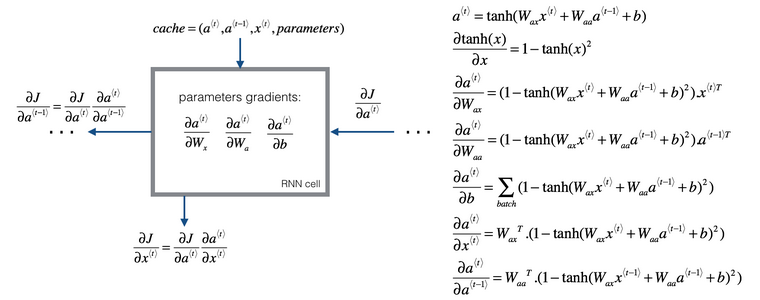</p>

#### Types of RNNs

In most cases, the size of the input sequence Tx is different than the ouput sequence Ty.

(pic from [link](http://karpathy.github.io/2015/05/21/rnn-effectiveness/))

<p align="center"></p>

* Many to many: both the input and output are sequences and Tx = Ty.
* Many to many: both the input and output are sequences but this time with different lengths, like Machine translation, with two distinct part, an encoder and a decoder.
* Many to one: In sentiment analysis per example, where we input a sequence and ouput a sentiment / integer between 0..5 on how positive or negative the input text is.
* one to one: ordinary nets, like feed forward nets.
* One to many: Like music generation, where we input one note and the network starts generating music notes, and reuse the outputs as net inputs to generate further new music.

### Language modeling

Language Modeling and LM for short, is the development of probabilistic models that are able to predict the next word in the sequence given the words that precede it. A statistical language model is a probability distribution over sequences of words. Given such a sequence, say of length m, it assigns a probability  to the whole sequence. Having a way to estimate the relative likelihood of different phrases is useful in many natural language processing applications, especially ones that generate text as an output.

*Language modeling is the task of assigning a probability to sentences in a language. […] Besides assigning a probability to each sequence of words, the language models also assigns a probability for the likelihood of a given word (or a sequence of words) to follow a sequence of words.* Neural Network Methods in Natural Language Processing, 2017.

A language model learns the probability of word occurrence based on examples of text. Simpler models may look at a context of a short sequence of words, whereas larger models may work at the level of sentences or paragraphs. Most commonly, language models operate at the level of words.

*The notion of a language model is inherently probabilistic. A language model is a function that puts a probability measure over strings drawn from some vocabulary.* An Introduction to Information Retrieval.

**RNN model** The RNN model for a language models, takes at the first time step a zero vector, and outputs with a softmax layer the probability over all possible words for the incoming words, the next input is the correct first word that the model should have predicted, and the goal now is to predict the second one given the first word p(X | word1), and so on, until the last word where the model needs to predict end of sentence token \<EOS\>.

<p align="center">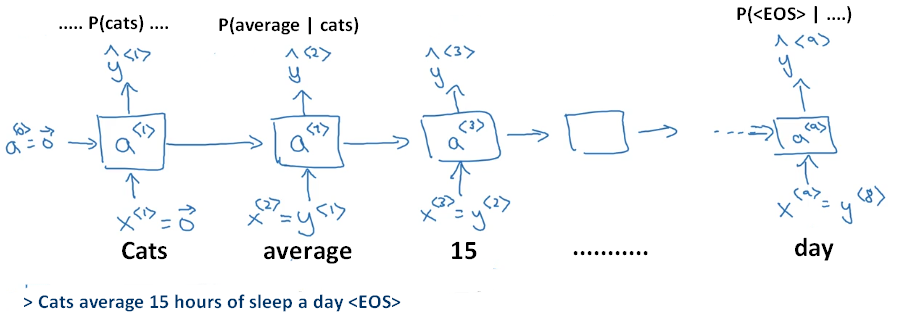</p>

To train this network we define a softmax loss function associated with each word / time step, and some over these loses to get the global cost.

&space;}&space;,&space;y&space;^&space;{&space;<&space;t&space;>&space;}&space;\right)&space;=&space;-&space;\sum&space;_&space;{&space;i&space;}&space;y&space;_&space;{&space;i&space;}&space;^&space;{&space;<&space;t&space;>&space;}&space;\log&space;\hat&space;{&space;y&space;}&space;_&space;{&space;i&space;}&space;^&space;{&space;<&space;t&space;>&space;}$$" title="$$\mathcal { L } \left( \hat { y } ^ { < t > } , y ^ { < t > } \right) = - \sum _ { i } y _ { i } ^ { < t > } \log \hat { y } _ { i } ^ { < t > }$$" />

&space;}&space;,&space;y&space;^&space;{&space;<&space;t&space;>&space;}&space;\right)$$" title="$$\mathcal { L } = \sum _ { L } \mathcal { L } \left( \hat { y } ^ { < t > } , y ^ { < t > } \right)$$" />

### Sampling novel sequences
After we train a sequence model, one of the ways we can informally get a sense of what is learned is sampling novel sequences.

A sequence model models the probability of any sequences of words as P(y\<1\> .... y\<Tx\>), and we want to sample from this distribution to generate novel sentences, for this we start with zero vectors, and we sample randomly from the output probability distribution of possible words (p(a), p(and) .... depending on the size of the dictionnary) and use the chosen word as the input for the next time step and keep doing the same thing, until we sample \<EOS\>, and we can reject any \<unk\> token we sample.

<p align="center">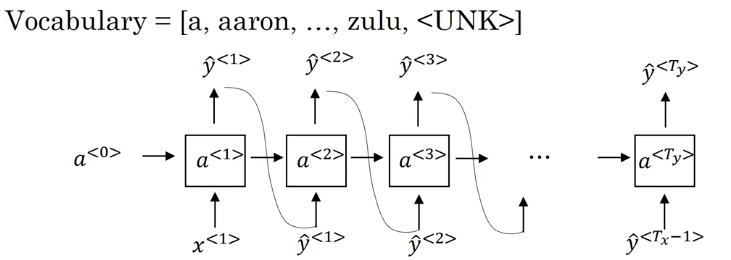</p>

Note: we can have also character level language models, where the dictionnary is all possible characters (lower and upper case) and possible symbols (, ;). some pros are not even worying about \<unk\> tokens, but we might end up with many sequences and are more computationnaly expensive to train.

### Vanashing and exploding gradients

One of the problem with vanilla RNNs is the vanashing and exploding gradients. In language we can have very long dependencies, like in the sentence "the *cat/cats* with .. ate ...... *was / were* ", depending on cat being plural or singular, the network needs to ouputs the correct prediction later in the sequence.

To learn such dependecies, the gradient from (was / were) needs to backpropagate over large number of steps to affect the earlier layers and modify how the RNN do computation in these layers, and with the problem of vanashing and exploding gradients, this becomes very unlikely, so in RNNs we only have local dependencies, where each word only depend on a limited number of words proceding it.

Gradient clipping: For exploding gradient we can apply gradient clipping, The overall loop structure usually consists of a forward pass, a cost computation, a backward pass, and a parameter update. Before updating the parameters, we perform gradient clipping when needed to make sure that the gradients are not "exploding," meaning taking on overly large values, but for vanashing gradients is much harder to solve.

<p align="center">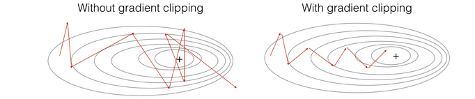</p>

### Gated Recurrent Unit (GRU)

We can vizualise the GRU unit as follows:

<p align="center">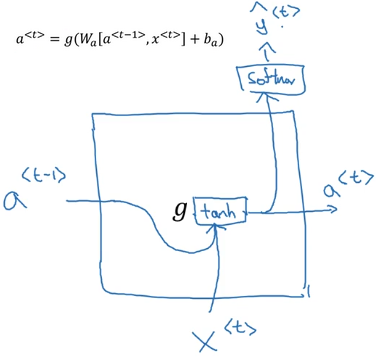</p>

GRU will have a new cell C called memory cell, providing a bit of memory to remeber if the car was singular or plural, }$" title="$c^{<t>}$" /> will output an activation }$" title="$a^{<t>}$" /> at every time step, we'll consider writing }$" title="$\tilde{C}^{<t>}$" /> to the memory cell, and the important idea of GRU, is having a gate  between zero and one (zero or one most of the time), and the gate will decide if we update the memory cell with the condidate }$" title="$\tilde{C}^{<t>}$" /> or not.

We also have another gate   which tells us how relative is the sate of the memory cell to compute the new condidate for the memory cell.

<p align="center">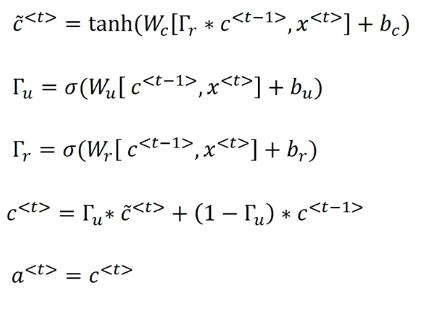</p>

The cell memory cell and the gate have the same dimension as the state of the hidden layer (element wise multiplication in the updating step).

In our example, after the network output was/were depending on the state of cat, we can then upfate the state of the memory cell.

<p align="center">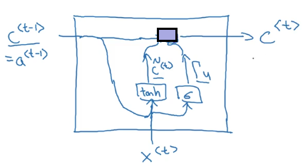</p>

### LSTMs
GRUs can allow us to learn very long range connections in a sequence. The other type of unit that allow us to do this very well is the LSTM or the long short term memory units. In LSTMs, instead of having one gate to decide wheather we update the state of the memory cell or not, we'll have two seperate gates, forget and update gate.

<p align="center">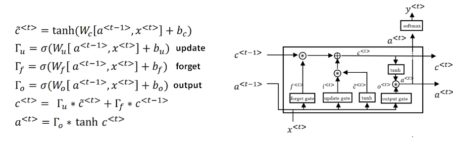</p>

### About the gates

#### - Forget gate

For the sake of this illustration, lets assume we are reading words in a piece of text, and want use an LSTM to keep track of grammatical structures, such as whether the subject is singular or plural. If the subject changes from a singular word to a plural word, we need to find a way to get rid of our previously stored memory value of the singular/plural state. In an LSTM, the forget gate lets us do this: 


Here,  are weights that govern the forget gate's behavior. We concatenate  and multiply by  The equation above results in a vector  with values between 0 and 1. This forget gate vector will be multiplied element-wise by the previous cell state  So if one of the values of  is 0 (or close to 0) then it means that the LSTM should remove that piece of information (e.g. the singular subject) in the corresponding component of  If one of the values is 1, then it will keep the information. 

#### - Update gate

Once we forget that the subject being discussed is singular, we need to find a way to update it to reflect that the new subject is now plural. Here is the formulat for the update gate: 


Similar to the forget gate, here  is again a vector of values between 0 and 1. This will be multiplied element-wise with  in order to compute 

#### - Updating the cell 

To update the new subject we need to create a new vector of numbers that we can add to our previous cell state. The equation we use is: 


Finally, the new cell state is: 


#### - Output gate

To decide which outputs we will use, we will use the following two formulas: 


Where we decide what to output using a sigmoid function, and then we multiply that by the  of the previous state.

#### LSTM backward pass

#### One Step backward

The LSTM backward pass is slighltly more complicated than the forward one. We have provided you with all the equations for the LSTM backward pass below. (If you enjoy calculus exercises feel free to try deriving these from scratch yourself.) 

#### gate derivatives

<p align="center"></p>

#### parameter derivatives 

<p align="center"></p>

To calculate  we just need to sum across the horizontal (axis= 1) axis on  respectively. This is done beacuse in the forward pas an automatic broadcasting was perfomed.

Finally, we will compute the derivative with respect to the previous hidden state, previous memory state, and input.


Here, the weights for equations 13 are the first n_a, (i.e.  etc...)


where the weights for equation 15 are from n_a to the end, (i.e.  etc...)

### Bidirectionnal RNNs
Sometime to be able to predict the correct ouput, the network needs not only the previous states but also the upcoming ones, such as these two examples :
* He said "Teddy bears are on sale"
* He said "Teaddy Roosevelt was a great president!"

BRNN tries to solve this issue using two compoents, forward component and backward component, thus defining an acyclic graph, where in the first step, we go from left to right to compute the forward activations, and then go back and compute the backward activations for the second component, all of this in the forward pass.

<p align="center"></p>

And both the forward and backward activations are used to compute the output:

&space;}&space;=&space;g&space;\left(&space;W&space;_&space;{&space;y}&space;[\overrightarrow{a}^{<t>},&space;\overleftarrow{a}^{<t>}]&space;&plus;&space;b&space;_&space;{&space;y&space;}&space;\right)$$" title="$$\hat { y } ^ { < t > } = g \left( W _ { y} [\overrightarrow{a}^{<t>}, \overleftarrow{a}^{<t>}] + b _ { y } \right)$$" />

But the biggest downside of BRNNs, is that we need to process the whole sequence before being able to ouput the first prediction.

### Deep RNNs
The different versions of RNNs we've seen so far will already work quite well by themselves. But for learning very complex functions sometimes is useful to stack multiple layers of RNNs together to build even deeper versions of these models.

Instead of having only one hidden state per time step, we can stack many hidden layer and have latteral connection between them.

<p align="center">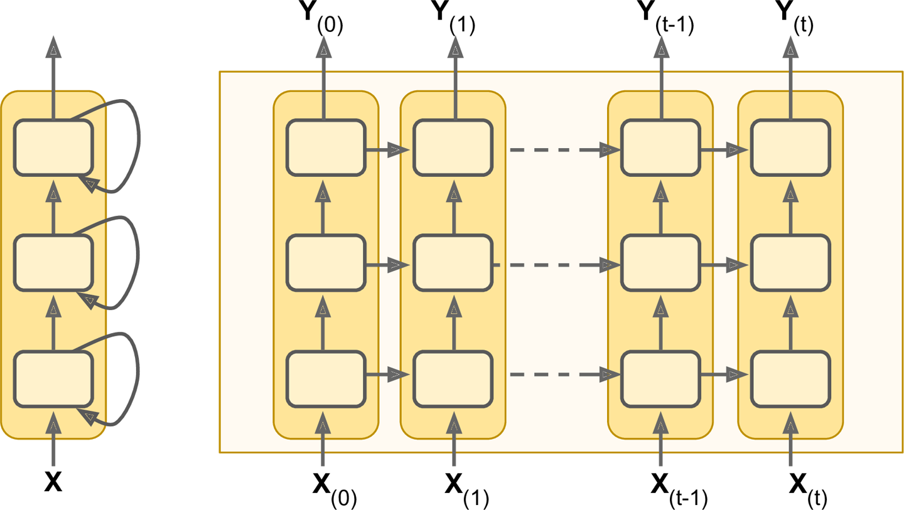</p>

For this type of networks, we only a limited number of layer (3 - 5) and even then the network is quite big, given the computation needed for long sequences.

___

## WEEK 2

### Introduction to word embeddings

Word embeddings is a way of representing words, to give the model a possibility to automatically understand analogies like, a man is to a woman, as a king is to a queen, and many other examples.

Word Representation: So far we're representing words using a vocabulary of words, and each input is a one hot vector of the size of the vocabulary. The problem is that there isn't any relationship between the words, given that the product between any two vector is zero and not the similarity of the two words.

If we are able to learn a given vector representation (dimension of the vector << size of the vocabulary), and take this high dimentionnal data and embed it on 2D space, we see similar words closer together. These word embeddings are trained in an unsupervised manner using very large corpus (100 Billion words) and then we can reuse them for specific tasks using the learned embeddings (a form of transfer learning), with the possbility to continue to adjust / fine tune the word embeddings for our tasks.

<p align="center">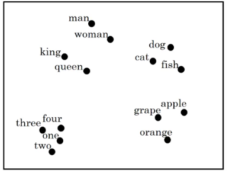</p>

#### Using word embeddings

If we take the same example in first week, using an RNN to detect the names in a given sentence, using word embeddings as inputs to the model instead of one hot vector, the model will be able to generalize more easily, and given new word (like durian, which is a fruit), even if the model see them for the first time, their word representations are similar to already seen examples.

Transfer learning and word embeddings:

1. Learn word embeddings from large text corpus (12 - 100B Words), or re-use the pre-trained embeddigns.
2. Transfer embeddings to new task with smaller training set (say, 100k words).
3. Optionnal: continue to finetune the words embeddings with new data.

Word embeddings can be used in analogies, given that the vector difference between man & women, is equal to the difference between king & queen. so E_man - E_women ~ E_king - E_queen, and if want to find the word Queen, we can optimise for the word to be similar to king as similar women is to man:


There is various similarity functions, such as:

**1- Euclidean distance**


**2- Cosine similarity** Given two vectors  and  cosine similarity is defined as follows: 


where  is the dot product (or inner product) of two vectors,  is the norm (or length) of the vector  and  is the angle between  and  This similarity depends on the angle between  and  If  and  are very similar, their cosine similarity will be close to 1; if they are dissimilar, the cosine similarity will take a smaller value. 

<p align="center">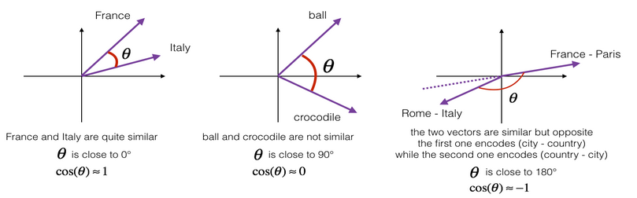</p>

**Embedding matrix** Let's start to formalize the problem of learning a good word embedding. When we implement an algorithm to learn a word embedding, we end up learning is an embedding matrix.

Given a corpus of 10,000 words, and we're learning a 300 dimenionnal embeddings, the embeddings matrix is of size 300 x 10,000, and to select a given embedding for word j, we multiply a 10,000 one hot vector where oj = 1, with the embedding matrix to select the j-column,  we initialize the matrix randomly and use gradient descent to learn the matrix. In practice, it is not efficient to use vector multiplication to extract the word embedding, but rather a specialized function to look up the embeddings.

<p align="center">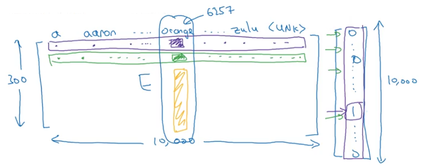</p>

### Learning word embeddings

People actually started off with relatively complex algorithms. And then over time,researchers discovered they can use simpler algorithms and still get very good results especially for a large dataset.

Say we want to predict the next word in a sequence using a language model, we first embedd the input word, and feed them into a hidden layer and then a softmax layer to predict the probalities over 10,000 words. The number of the input words depend on the number of the previous words we'd like to consider.

<p align="center">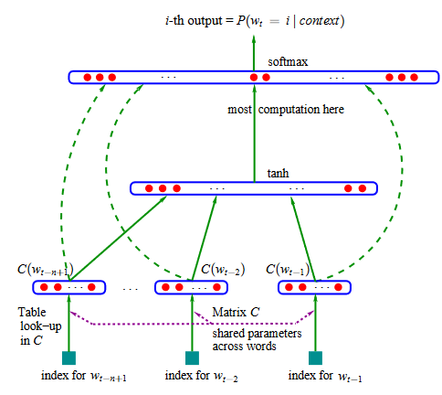</p>

We can also use as input, not only the previous words, but also the words on the right as the context, of just the last word, or even bearby 1 word (skip gram)

#### Word2vec / Skip gram

Say given a corpus, we want to construct a set of examples, where the input is a given word in some sentence, and the ouput / target is the word close by, example : I wan a glass of orange huice to go along with my cereal, inputs / context: Orange, Orange, Orange, target: Juice, glass, my. From here comes the meaning of the name, we skip some and then predict the up coming words. We can sample the context words using a uniform distribution; but we'll end up sampling the common words much more often, in practice different huristics can be used to balance the sampling.

For that we construct a simple network, given a one hote vector, get the word embedding using the embedding matrix E, and use the embedding as input to a softmax layer, and the lernable parameters, and the matrix elements and softmax parameters (how likely each ouput is):

    Context word ---> E matrix ---> embedding ---> Softmax ----> prediction

Softmax ouputs are computed as follows:


The problem with the skip gram model is that for each time we want to evaluate the probability, we need to sum over all the word in the vocabulary, with is very slow given how big some vocabularies are, one solution is using Hierarchical softmax, with a complexity of O(log(n)) using a tree (can be asymetric), where most commons words tend to be on top and less common words deeper to further reduce the computations.

#### Negative sampling
The training objective, is given two words, are these two word have relative meaning (close together in a sentence) or not. To construct the training exmaples, for positives we pick a context word and a second word from the neibhood of the target, and for negatives we choose the second word randomly. For each one positive example we'll k negatives (5-20 depending on the size of the dataset).

One problem is that if we sampled randomly / according to the empirical frequency the second words, we'll end up with more negatives of the frequent words in the corpus, the solution is using the frequency of a given word to calculate the probability of sampling a given word:


To solve the computation problem, we model the problem as a binary logistic regression problem instead if using 10,000 way softmax, at each step only k+1 classifiers are modified (k negatives and 1 positive).


<p align="center">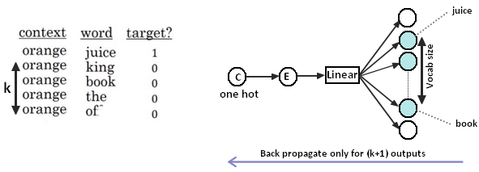</p>

#### GloVe word vectors

GloVe trains word embeddings by performing a weighted factorisation of the log of the word co-occurrence matrix. The model scales to very large corpora and performs well on word analogy tasks.

The cost function is given by:


where:

* V is the size of the vocabulary,
* X denotes the word co-occurrence matrix (so  is the number of times that word j occurs in the context of word i)
*  = # times i appears in the context of j,  can be symetric if the context is a window.
* the weighting f is given by  if $ < x_{\text{max}}$ and 1 otherwise, to avoid doing the computation when Xi,j = 0
*  = 100 and  (determined empirically),
*   are the two layers of word vectors,
*   are bias terms.

Note that the product is only over pairs i, j for which  is non-zero. This means that GloVe (in contrast to word2vec with negative sampling) trains only “positive samples” and also that we don’t have to worry about the logarithm of zero.

<p align="center">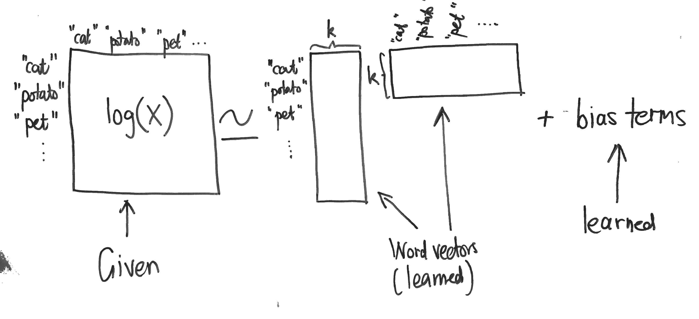</p>

### NLP applications

#### Sentiment Analysis

is the most common text classification tool that analyses an incoming message and tells whether the underlying sentiment is positive, negative or neutral.

<p align="center">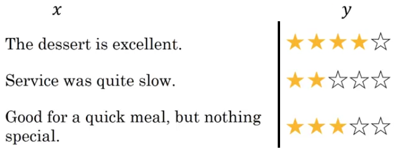</p>

One simple way to perform sentiment analysis of a given sentence, is to transform the one hot vectors of each word in the sentence into its word emebdding, and take the average of these vectors and then feed it into a softmax to predict a sentiment. But the problem of such approach is that we don't take into account the position of the words, and so if good appears multipple times even if the whole sentence is negative is model will predict a positive sentiment.

<p align="center">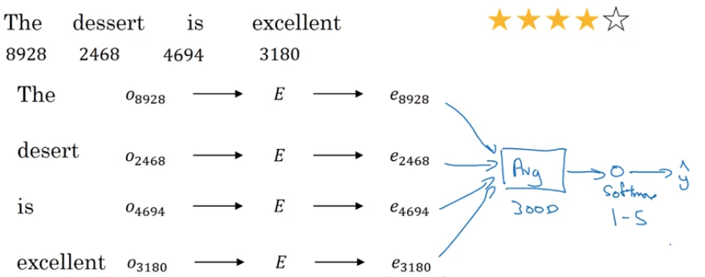</p>

A possible solutions is to use many-to-one RNN network and give the word embeddings at each time step, and at the last one predict the sentiment.

<p align="center"></p>

#### Debiasing word embeddings

Word embeddings can reflect gender, ethnicity... and other biases of the text used to train the model, How to adress these biases in word embeddings?

1. Identify bias direction, using   ..., to find the direction of bias (can be 1D or higher).
2. Neutralize: for every word that is not definitional, project to get rid of bias.
3. Equalise pairs.

**Neutralizing bias for non-gender specific words** 
If we're using a 50-dimensional word embedding, the 50 dimensional space can be split into two parts: The bias-direction  and the remaining 49 dimensions, which we'll call  In linear algebra, we say that the 49 dimensional  is perpendicular (or "othogonal") to  meaning it is at 90 degrees to  The neutralization step takes a vector such as  and zeros out the component in the direction of  giving us $e_{receptionist}^{debiased}$.

Even though  is 49 dimensional, given the limitations of what we can draw on a screen, we illustrate it using a 1 dimensional axis below.

<p align="center">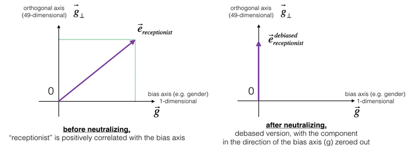</p>

We compute  by first computing  as the projection of  onto the direction  and then substracting the bias componenet: 


**Equalization algorithm for gender-specific words**: Equalization is applied to pairs of words that we might want to have differ only through the gender property. As a concrete example, suppose that "actress" is closer to "babysit" than "actor." By applying neutralizing to "babysit" we can reduce the gender-stereotype associated with babysitting. But this still does not guarantee that "actor" and "actress" are equidistant from "babysit." The equalization algorithm takes care of this.

The key idea behind equalization is to make sure that a particular pair of words are equi-distant from the 49-dimensional  The equalization step also ensures that the two equalized steps are now the same distance from  or from any other work that has been neutralized. In pictures, this is how equalization works:

<p align="center">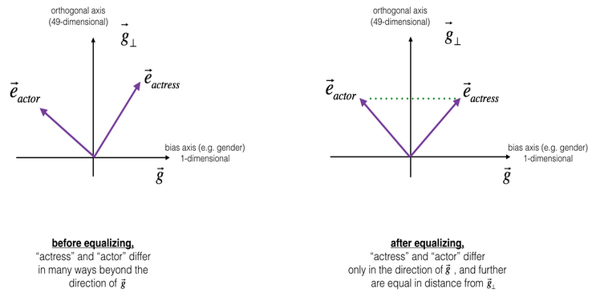</p>

This is done using the following equations [details](https://arxiv.org/abs/1607.06520) :

<p align="center">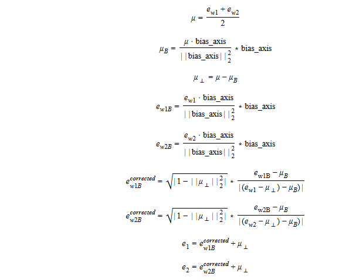</p>

These debiasing algorithms are very helpful for reducing bias, but are not perfect and do not eliminate all traces of bias. For example, one weakness of this implementation was that the bias direction  was defined using only the pair of words _woman_ and _man_. As discussed earlier, if  were defined by computing    and so on and averaging over them, we would obtain a better estimate of the "gender" dimension in the 50 dimensional word embedding space.

___
## WEEK 3

### Various sequence to sequence architectures

**A basic model** is to use an encoder for encode the inputs, and a decoder to generate the output sequence, this is can be applied to translation, where the encoder and the decoder are both RNNs (many to many),

<p align="center">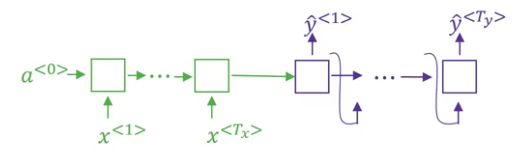</p>

or for image captionning where the encoder is a CNN and the decoder is a RNN.

<p align="center"></p>

A decoder is similar to a language model which models (a probability of a sequence of words P(y1, .... yTy)), but instead of taking a first input state a0 as a zero vector, it takes the ouput of the encoder. so the output of the decoder will be conditionned on the input $ \left( y ^ { < 1 > } , \ldots , y ^ { < T _ { y } > } | x \right)$ now to generate a translation, we can simply sample randomly the ouputs y at each time step and feed them as inputs in the next time step, because will have different translation each time we run the model, so we wan to find the sentence that maximises the conditionnal probability:

}&space;,&space;\ldots&space;,&space;y&space;^&space;{&space;<&space;T&space;y&space;>}&space;&space;}&space;P&space;\left(&space;y&space;^&space;{&space;<&space;1&space;>&space;}&space;,&space;\ldots&space;,&space;y&space;^&space;{&space;<&space;T&space;_&space;{&space;y&space;}&space;>&space;}&space;|&space;x&space;\right)$$" title="$$\arg \max _ { y ^ { <1 >} , \ldots , y ^ { < T y >}  } P \left( y ^ { < 1 > } , \ldots , y ^ { < T _ { y } > } | x \right)$$" />

The same objective can be expressed as:
&space;}&space;|&space;x&space;,&space;y&space;^&space;{&space;<&space;1&space;>&space;}&space;,&space;\ldots&space;,&space;y&space;^&space;{&space;<&space;t&space;-&space;1&space;>&space;}&space;\right)$$" title="$$\operatorname { arg } \max _ { y } \prod _ { t = 1 } ^ { T _ { y } } P \left( y ^ { < t > } | x , y ^ { < 1 > } , \ldots , y ^ { < t - 1 > } \right)$$" />

One solution is greddy search, in which at each time step we choose the word with the heighest probability. But this results in not very good results and maybe choosing the most probable word does not maximise the conditionnal probability as a whole.

#### Beam search
Beam search is one way to maximise the conditionnal probability, let's take a translation example, "Jane visite l'Afrique en Septembre", and hopefully the output will be "Jane visits Africa in Setember".

First we input the french sentence in the encoder, and then the decoder receives the ouput of encoder and we obtain a probability distribution over all 10,000 words for the first word, with a beam width B = 3 in Beam search, we'll keep the 3 most probable words P(y1 | x), and then use three networks to predict the next word, for each one, the input to the next time step is one of the words we kept, to get P(y2 | y1, x), and then we can calculate 
<p align="center">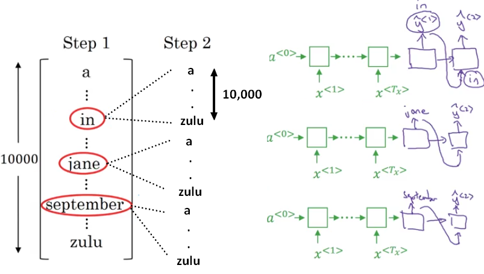</p>

After the second step, we choose the three most probable pairs of words P(y2, y1 | x), and use the three networks to find the most probable 3 triplets of words P(y3, y2, y1 | x) in the next step, and so on.

<p align="center">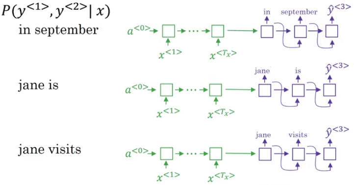</p>

**Refinements to Beam Search**

*Length normalization:* In practice instead of maximise the product of probabilities, we maximsise the sum of log of the probabilities: 

&space;}&space;|&space;x&space;,&space;y&space;^&space;{&space;<&space;1&space;>&space;}&space;,&space;\ldots&space;,&space;y&space;^&space;{&space;<&space;t&space;-&space;1&space;>&space;}&space;\right)$$" title="$$\arg \max _ { y } \sum _ { y = 1 } ^ { T _ { y } } \log P \left( y ^ { < t > } | x , y ^ { < 1 > } , \ldots , y ^ { < t - 1 > } \right)$$" />

Given that most probabilities are less then one, multiplying them can result in numerical overflow, so using a log function, we can obtain the same results given that the log is a monotonically increasing function while having numerical stability. One downside of these two equations, is that we prefer shorter sentences, given when we multiply probabilities / add log probabilities, the value deacreses, for that it is better to take the average of the log of probabilities, with a heuristic alpha to adjust how much we prefer shorter sentences.

&space;}&space;|&space;x&space;,&space;y&space;^&space;{&space;<&space;1&space;>&space;}&space;,&space;\ldots&space;,&space;y&space;^&space;{&space;<&space;t&space;-&space;1&space;>&space;}&space;\right)$$" title="$$\frac { 1 } { T _ { y } ^ { \alpha } } \sum _ { t = 1 } ^ { T _ { y } } \log P \left( y ^ { < t > } | x , y ^ { < 1 > } , \ldots , y ^ { < t - 1 > } \right)$$" />

*How to choose the width B:* with a large B, we get better result but the running time is slower, and with smaller B, the results are worse but the faster, but in general, we might get diminishing returns when we get to some value B.

Side note: unlike exact search algorithms, Like BFS (breadth first search) or DFS (Depth first search), beam search runs faster but is not guaranteed to find maximum for arg max p(y | x).

**Error analysis in beam search**

Error analysis is important so we can figure out whether it is the beam search algorithm that's causing problems and worth spending time on.
Or whether it might be the RNN model that is causing problems and worth spending time on.

How to perform error analysis? given a predicted ouput  and possible correct translation given by a human y\*:

* Human: Jane visits Africa in September (y\*).
* Algorithm: Jane visited Africa last September. ($\^{h}$)

    - Case 1:
        - Beam search chose  but y\* attains higher probability.
        - conslusion: Beam search is at fault.
    - Case 2:
        - y\* is a better translation than  But RNN predicted 
        - conslusion: RNN search is at fault.

We can do that for many examples, and find out what fraction of errors are due to beam search vs RNN model, and than do a deeper error analysis for each part.

### Blue score
One of the challenges of machine translation is that given a French sentence, there could be multiple English translations that are equally good translations of that French sentence. So how do we evaluate a machine translation system if there are multiple equally good answers, unlike, say, image recognition where there's one right answer where we just measure the accuracy. If there are multiple great answers, how do we measure accuracy? The way this is done conventionally is through the BLEU score.

Blue gives the N-gram overlap between machine translation output and reference translation, first we compute precision for n-grams of size 1 to 4, and then calculate the blue score:


Example:
* System A: Israeli officials responsibility of airport safety.
* System B: airport security Israeli officials are responsible
* Reference: Israeli officials are responsible for airport security.

In system A, we have two matches: 2-gram match (Israeli officials) and 1-gram match (airport), for the second system we have 4-gram match(Israeli officials are responsible) and 2-gram match (airport security).

<p align="center">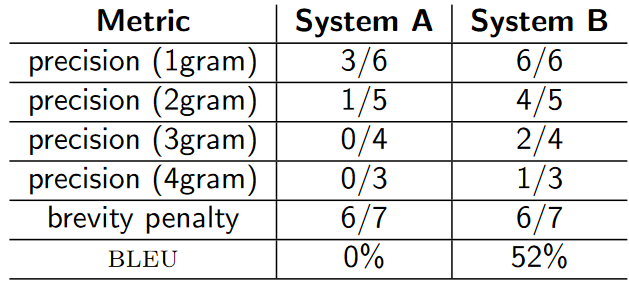</p>

### Attention model
Until now, we've been using an Encoder-Decoder architecture for machine translation. Where one RNN reads in a sentence and then a different one outputs a sentence. There's a modification of this called the Attention Model, that makes all this work much better.

The simple encoder-decoder models work quite well with small sentences, but the blue score deacreases quite rapidly when the sentences are longer.

The main idea of attention models is that instead of using the output vector of the last word, we can use the output vectors of all words. However, this becomes tricky because now instead of a fixed length vector we are dealing with a variable dimension matrix, i.e we have a vector for each word of the sequence.

So, the better approach would be to aggregate the word vectors into a fixed length vector based on some context. Attention Model is just a way of doing the aggregation. It provides a recipe for aggregating the output vectors of each word into a single vector based on some context. in the context of machine translation, the translated word at position t is dependent on the aggregation of all output vector of the input sequence. In this way, the network can choose what words are important and use information only from those words to construct the fixed length vector / pay attention only to a part of the input system.

}$" title="$\alpha^{<t, t^\prime>}$" /> = amount of attention  should pay to }$" title="$a^{<t^\prime>}$" />
<p align="center">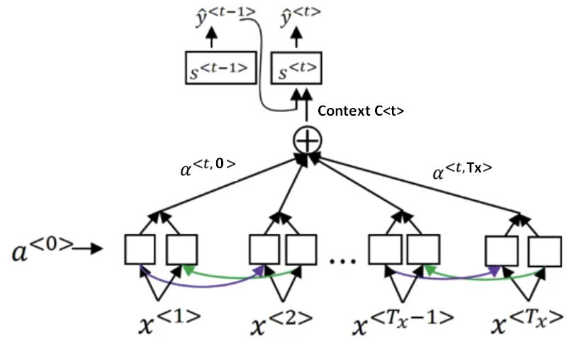</p>

For a bidirectionnal RNN, each activation contains the forward and backward componenet :
&space;}&space;=&space;(&space;\vec{a}^{<t>}&space;,&space;a^{<t^\prime>})$$" title="$$a ^ { <t^\prime> } = ( \vec{a}^{<t>} , a^{<t^\prime>})$$" />

And then the context is computed as a weighted sum of the activation given the attention weights &space;}&space;=&space;1$" title="$\sum _ { t } \alpha ^ { < 1 , t ^ { \prime } > } = 1$" /> (here for the first ouput, t = 1):

&space;}&space;a&space;^&space;{&space;\left\langle&space;t&space;^&space;{&space;\prime&space;}&space;\right\rangle&space;}$$" title="$$c ^ { ( 1 ) } = \sum _ { t ^ { \prime } } \alpha ^ { < 1 , t > } a ^ { \left\langle t ^ { \prime } \right\rangle }$$" />

How to compute attention weights? we use a softmax using the old hidden state of the attention model and the current state of the RNN, and then train a small neural net to learn the weights.

<p align="center">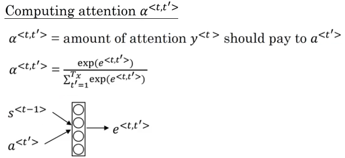</p>

One problem is the quadratic loss, where the number of weights is Tx * Ty, in machine translation, this can be acceptable.


**Illustration of Attention mechanism**: Here is a  more detailed illustration of the attenstion mecanism. The diagram on the left shows the attention model. The diagram on the right shows what one "Attention" step does to calculate the attention variables  which are used to compute the context variable  for each timestep in the output ($t=1, \ldots, T_y$).

<table>
<td> 
 <br>
</td> 
<td> 
 <br>
</td> 
</table>
<caption>

Here are some properties of the model: 

- There are two separate LSTMs in this model (see diagram on the left). Because the one at the bottom of the picture is a Bi-directional LSTM and comes *before* the attention mechanism, we will call it *pre-attention* Bi-LSTM. The LSTM at the top of the diagram comes *after* the attention mechanism, so we will call it the *post-attention* LSTM. The pre-attention Bi-LSTM goes through  time steps; the post-attention LSTM goes through  time steps. 

- The post-attention LSTM passes  from one time step to the next. In the lecture videos, we were using only a basic RNN for the post-activation sequence model, so the state captured by the RNN output activations  But since we are using an LSTM here, the LSTM has both the output activation  and the hidden cell state  However, unlike previous text generation examples, in this model the post-activation LSTM at time  does will not take the specific generated  as input; it only takes  and  as input. We have designed the model this way, because (unlike language generation where adjacent characters are highly correlated) there isn't as strong a dependency between the previous character and the next character in a YYYY-MM-DD date. 

- We use  to represent the concatenation of the activations of both the forward-direction and backward-directions of the pre-attention Bi-LSTM. 

- The diagram on the right uses a `RepeatVector` node to copy 
 value  times, and then `Concatenation` to concatenate  and  to compute  which is then passed through a softmax to compute 

### Speech recognition

the goal of speech recongnition, is to use an input x as 1D sound wave /  preprocess to obtain spectogramms, and obtain as ouput the transcript, we can use in such problem a RNN, taking as inputs the sound wave at each time step, depending on the frequence, one ouputing either the character, or a blank space. In this case the number of inputs steps is greater the the ouputs, for that we ue CTC, connectionnist temporal classification to reduce the output to the correct transcript (tttt ____ hh __ ee -> the) without having to give the correct labels at each time step, just the correct word (the).

#### Application: Trigger words

**From audio recordings to spectrograms** Let's take the details of a system capable of detecting a triger word, in this example the trigger word is `activate` given positives, recordings of activate, and negatives, which are recodings of other words, and background sound.

What really is an audio recording? A microphone records little variations in air pressure over time, and it is these little variations in air pressure that the ear also perceives as sound. We can think of an audio recording as a long list of numbers measuring the little air pressure changes detected by the microphone. We will use audio sampled at 44100 Hz. This means the microphone gives us 44100 measurements per second. Thus, a 10 second audio clip is represented by 441000 values.

It is quite difficult to figure out from this "raw" representation of audio whether the word "activate" was said. In  order to help the sequence model more easily learn to detect triggerwords, we will compute a *spectrogram* of the audio. The spectrogram tells us how much different frequencies are present in an audio clip at a moment in time.

A spectrogram is computed by sliding a window over the raw audio signal, and calculates the most active frequencies in each window using a Fourier transform.

The spectogram represents how active each frequency is (y axis) over a number of time-steps (x axis).

<p align="center">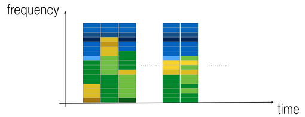</p>

Spectrogram of an audio recording, where the color shows the degree to which different frequencies are present (loud) in the audio at different points in time. Green squares means a certain frequency is more active or more present in the audio clip (louder); blue squares denote less active frequencies. 

The dimension of the output spectrogram depends upon the hyperparameters of the spectrogram software and the length of the input. Given 10 second audio clips as the "standard length" for the training examples. The number of timesteps of the spectrogram will be 5511, so 

With 10 seconds being the default training example length, 10 seconds of time can be discretized to different numbers of value. With 441000 hz (raw audio) and 5511 (spectrogram). In the former case, each step represents  seconds. In the second case, each step represents  seconds. 

For the 10sec of audio:

-  (raw audio)
- 10000 used to synthesize audio
-  (spectrogram output, and dimension of input to the neural network). 
-  (the number of steps in the output of the GRU). 

Each of these representations correspond to exactly 10 seconds of time. It's just that they are discretizing them to different degrees. All of these are hyperparameters and can be changed (except the 441000, which is a function of the microphone). We have chosen values that are within the standard ranges uses for speech systems. 

Consider the  number above. This means that for the output of the model, we discretize the 10s into 1375 time-intervals (each one of length 
 and try to predict for each of these intervals whether someone recently finished saying "activate."

Consider also the 10000 number above. This corresponds to discretizing the 10sec clip into 10/10000 = 0.001 second itervals. it means we are using 10,000 steps. To be used to generate training examples.

**Generating a single training example**: Because speech data is hard to acquire and label, it is better to synthesize the training data using the audio clips of activates, negatives, and backgrounds. It is quite slow to record lots of 10 second audio clips with random "activates" in it. Instead, it is easier to record lots of positives and negative words, and record background noise separately (or download background noise from free online sources).

To synthesize a single training example:

- Pick a random 10 second background audio clip
- Randomly insert 0-4 audio clips of "activate" into this 10sec clip
- Randomly insert 0-2 audio clips of negative words into this 10sec clip

Because we synthesized the word "activate" into the background clip, we know exactly when in the 10sec clip the "activate" makes its appearance. Given that  represent whether or not someone has just finished saying "activate." Given a background clip, we can initialize  for all  since the clip doesn't contain any "activates.", When we insert or overlay an "activate" clip, we will also update labels for  so that 50 steps (50 steps because we would be quite satisfied if the GRU detects "activate" anywhere within a short time-internal after finishing saying activate moment) of the output now have target label 1. And we will train a GRU to detect when someone has *finished* saying "activate".

#### Model

<p align="center">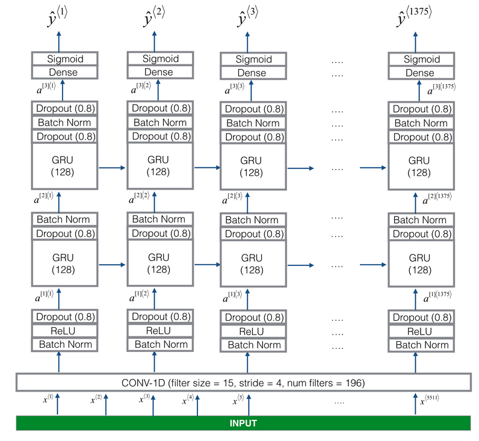</p>

One key step of this model is the 1D convolutional step. It inputs the 5511 step spectrogram, and outputs a 1375 step output, which is then further processed by multiple layers to get the final  step output. This layer plays a role similar to the 2D convolutions you saw in CNNs, of extracting low-level features and then possibly generating an output of a smaller dimension.

Computationally, the 1-D conv layer also helps speed up the model because now the GRU  has to process only 1375 timesteps rather than 5511 timesteps. The two GRU layers read the sequence of inputs from left to right, then ultimately uses a dense+sigmoid layer to make a prediction for  Because  is binary valued (0 or 1), we use a sigmoid output at the last layer to estimate the chance of the output being 1, corresponding to the user having just said "activate."

Note that we use a uni-directional RNN rather than a bi-directional RNN. This is really important for trigger word detection, since we want to be able to detect the trigger word almost immediately after it is said. If we used a bi-directional RNN, we would have to wait for the whole 10sec of audio to be recorded before we could tell if "activate" was said in the first second of the audio clip.  
